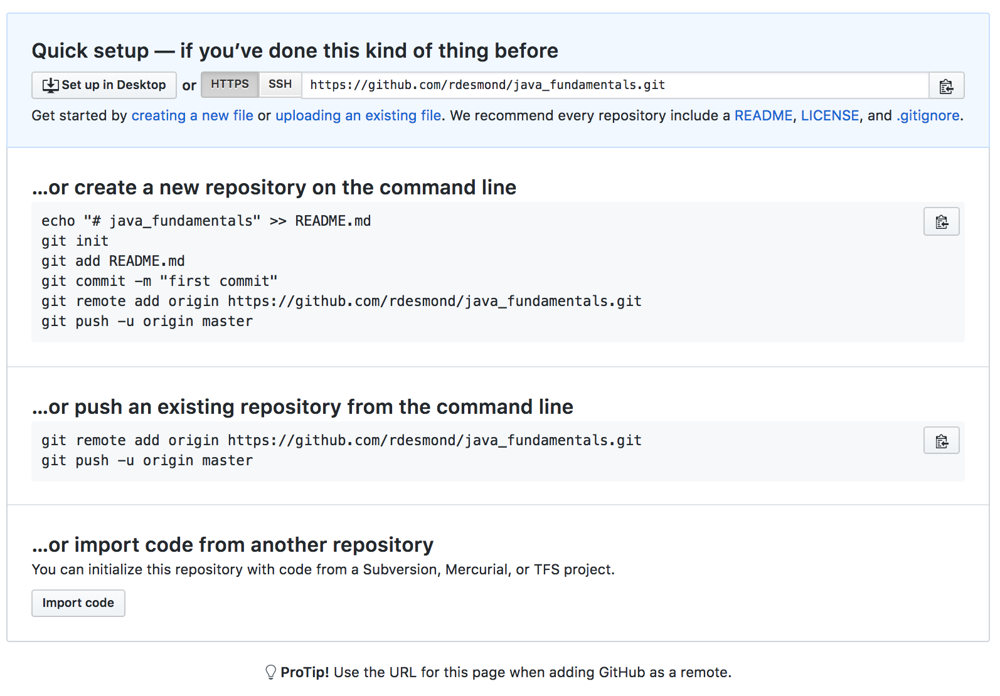

### Folder Structure

Alright, future Flask black belt, the first thing you'll want to do to begin your training is to make a dedicated folder where you'll put all your coursework. The goal here is to make sure you're organized and know where to find your files! So find a good place, but as a suggestion, you can make a new CodingNomads folder in your home folder.

Note: If you're a CodingNomads alumni, you can probably skip this step. Just find where your CodingNomads folder is and pick up at "Create a Git Repo"

```bash
cd ~/Documents
mkdir CodingNomads
cd CodingNomads
```

Once you get that created, go ahead and create two more folders to organize a little further.

```bash
mkdir labs projects
```

[//]: # (More?)

### Create a Git Repository

Great! Now that you got the folder creation out of the way, let's move onto making a git repository for your music sharing social network project.

[//]: # (Remember to insert links to Git resources in the course)

First, change directory to your `projects` folder and make a new git repo with the `git init` command. Now you'll have to give the new repository a name. For this project, just name it `flask-webdev`.

```bash
cd ~/Documents/CodingNomads/projects
git init flask-webdev
```

Boom, now you have a new `flask-webdev` repo, where you'll soon build an web app from scratch.

#### Make the Github Remote Repository

You'll make a Github repository for your project so you can push your work up to the internets. If you don't already have a Github account, <a href="https://github.com/join" target="_blank">click here to make a free account.</a>

Once you're all set up with Github and are logged in, click the + icon in the top right corner and then click "New Repository."

[//]: # (I'll probably change the name from Ragtime to something that sounds more "code-y". Maybe.)

Now you'll have to give the new repository a name. For this project, just name it `flask-webdev`. Leave the description blank for now, keep "public" selected, and finally, leave "Initialize this repository with a README" unchecked.

Click "Create Repository". After that, you'll see something similar to the this:



#### Add your new Github repository as a "remote" to your local Git repo

Once you've done that, you'll need to connect your local repo to your Github repo. You'll use the `git remote add` command to do just that. Change into your `flask-webdev` directory and add the new Github remote:

```bash
cd flask-webdev
git remote add origin https://github.com/<YOUR GITHUB USERNAME>/flask-webdev.git
```

Now, just make sure the remote was added successfully:

```bash
git remote -v
```

If it shows up, great! Now let's make sure it work by pushing your first commit. Send a message to your future self in the form of a `README.md`, or just a general description works too. The message can be anything you want, but make it positive!

```bash
echo "My first Flask app" > README.md
git add README.md
git commit -m "First commit"
git push -u origin master
```

If everything worked okay, you should have gotten output that eventually said "Branch master set up to track remote branch master from origin." Refresh the Github page to see your commit.

___

Congrats, you're now all set to keep updating your project to version control! Remember, the `flask-webdev` repo directory you made earlier will be *the* place to keep your first Flask app. Next, you'll ready your virtual environment for the journey ahead.