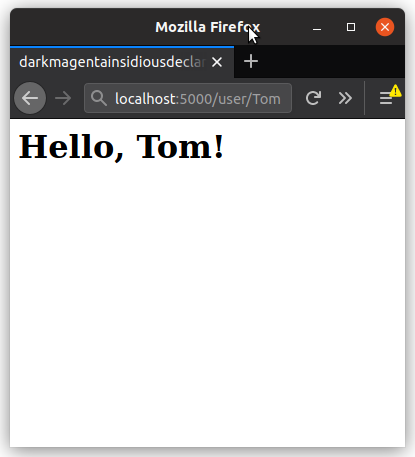

### Using Variables In Templates

From the last lesson, you know from believing your nomadic Flask course creator and all his sage, vast wisdom (who couldn't quite type the previous with a straight face) that the Jinja template engine can handle variables, as long as the Flask application does its part by passing them over. For a simple but dynamic page that does this relay, the view function would look like so:

```python
@app.route('/user/<username>')
def user(username):
    return render_template("user.html", username=username)
```

Crack open a new `user.html` template file and crack your knuckles 'cause here's the template content:

```jinja2
<h1>Hello, {{ username }}!</h1>
```

Wuzzat?! Looks like some weird HTML, but this is how Jinja likes its variables prepared for breakfast. Er, to render. The double curly brackets `{{}}` tell Jinja that whatever's inside them is a placeholder that should have a value assigned to it, and to render the template with that value instead. If you head to `localhost:5000/user/Tom` in your browser, you'll be greeted as Tom even though that's probably not your name!



### Flexible Placeholders

Here's the really neat thing: you can type almost anything Pythonic in these placeholder sections and Jinja will know how to render it. Even cooler, you can put these placeholders almost *anywhere* in the template and Jinja will still expand them to their actual values. That is, as long as you pass every value Jinja needs to render into the template. Here's some other other examples:

```jinja2
<p>Sticks and stones may break my bones but Jinja understands my dictionary lookups: {{ my_dict['key'] }}<p>
<p>George Washington once said: "With Jinja, I can put two variables in one placeholder! See: {{ my_list[my_int] }}</p>
<font size="{{ my_int }}">THIS TEXT IS HUGE! or tiny</font>
<p>I scream for {{ my_str.upper() }}</p>
```

Dictionaries, indexing a list with another variable, changes to styling, even calling object methods. All of it works in a placeholder if it's 1) Python code and 2) Jinja knows about it.

Oh, and one more thing! Jinja also includes filters which can go after a variable with a pipe character in between. For that last example about screaming, you can also do the following to get the same result:

```jinja2
<p>I scream for {{ my_str|upper }}</p>
```

`upper` is just one filter to choose from, but here are some others:

| Filter name    | Description                                   |
| -------------- | --------------------------------------------- |
| `capitalize`   | Uppercase the first character                 |
| `lower`        | Lowercase all characters                      |
| `safe`         | Render value without applying escaping        |
| `striptags`    | Remove any HTML tags before rendering         |
| `title`        | Return a titlecased version of the value      |
| `trim`         | Strip leading and trailing characters         |
| `upper`        | Uppercase all characters                      |

___

You just learned about variables in Jinja, but don't you want more *control* over your templates? You're in luck, because in the next section, you'll apply control structures to your templates.