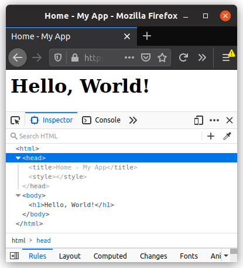

You were just introduced to variables in Jinja and how they put the power of Python into your templates, but there must be more, right? There is, and in this section, you'll get to know the control structures that Jinja provides for you—the `if`s, the `for`s, and a few mores!

Python wouldn't be Python without its conditionals and control flow. And it turns out Jinja wouldn't be Jinja for the same reason! Let's just go straight through what control structures Jinja has, and take note that each of these uses a `` construct:

#### `if`, `elif`, `else`

"Should I display that element, or shouldn't I?" That, along with other hard and not-so-hard questions, can be handled with conditional statements:

```html

    Hello, {{ user }}!

    Hi, Anonymous!

```

Now you can know who's looking at the page! Unless they don't tell us...

#### `for`

Lists of elements are no match for Jinja; they shall be rendered consecutively if you so choose! These are great for using in HTML list tags.

```html
<ul>
    
        <li>{{ song }}</li>
    
</ul>
```

Delicious!

#### `macro`

Macros? What the heck are those? Think of them as the Jinja version of Python functions. They're great for avoiding monotonous tasks. Watch:

```html

    <li>{{ song }}</li>


<ul>
    
        {{ render_song_title(song) }}
    
</ul>
My least favorite song ever: {{ render_song_title(bad_song) }}
```

Automation! The best thing since sliced bread.

#### `import`

    To copy others is necessary, but to copy oneself is pathetic.
        ~Pablo Picasso

Y'know, Picasso is onto something here. In some cases, it's extremely useful to copy one template into another, and that's exactly what Jinja's `import` statement does. But, "to copy oneself is pathetic?" If he's talking about Jinja, I think maybe he meant "silly."

```html

```

Would some `macro` statements and an `import` or two be useful? You betcha. In fact, that's the definition of "synergy":

```html

<ul>
    
        {{ macros.render_song_title(song) }}
    
</ul>
```

Defining one or more macros and one template, then importing them for painless access in another? Sweet.

#### `extends` and `block`

You a Java(Script) coder? 'Cause the `extends` keyword makes a comeback in Jinja (if you can call it that). You're darn tootin': *inheritance* in templates! Using `block` structures, you can define and then *extend* or even override *blocks* of template code.

If you make a "base" template called `base.html`, you can "reserve" blocks of code to hold certain content in certain places that can be inherited later.s

```html
<html>
<head>
    
    <title> - My App</title>
    
</head>
<body>
    
    
</body>
</html>
```

You'll see here that blocks of code are defined with arbitrary names, in this case `head`, `title`, and `body`. Another template that extends this base template (let's call it `index.html`) might look like this:

```html

Home

    {{ super() }}
    <style></style>


<h1>Hello, World!</h1>

```

It has an `extends` control structure, which means it's definitely a derived template. Alrighty, try to follow along here: so you see how the `title` block is inside the `head` block in `base.html`? It is *outside* the `head` block in `index.html`. For blocks that show up in both base and derived templates, the content in the derived template *always* gets used instead of the content in the base template. Here's how `index.html` is rendered:

- `title` - content is `Home`
- `head` - the textual content is `Home - My App` since `title` is contained within `head`, and shows up as the page's title (the browser tab text); `super()` is used to *bring in* the content from the base class, then afterwards it is *extended* with a `<style>` tag
- `body` - content is just `Hello World!`



#### Comments

These don't actually *control* anything, but they can be useful! Instead of using `<!-- HTML comments -->`, for templates it's better to use `{# these comments #}`

### What's Next

Phew! Those are all the important control structure you'll need to be familiar with in this course. Don't worry, you'll see them again and again so you'll get used to them.

But gosh, don't these pages just make you feel a little uneasy? Now don't get me wrong, Flask is freakin' cool, but these pages look like they came from the Internet Stone Age, back when dial-up was a thing. And to answer your next question you almost certainly have: *YES!* Of course there's an easy way to get a much prettier, modern look! Hop on over to the next lesson.
