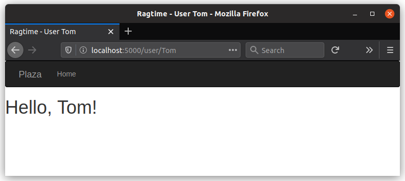

If you've been around the web development social bubble at all, you've probably heard about Twitter's open-source web browser framework called <a href="http://getbootstrap.com" target="_blank">Bootstrap</a>. The selling point of Bootstrap is simple: tons of slick-looking user interface components that are compatible with all modern browsers on both desktop and mobile. And of course it's free and super popular, so is anyone surprised there's a Flask extension called Flask-Bootstrap that gives you nice looking pages right out of the box?

If you *were* surprised, my apologies. For your information, Bootstrap operates on the client-side basically by slapping on some CSS and JavaScript to those otherwise old-school looking HTML pages. While Flask <a href="https://www.youtube.com/watch?v=zGxwbhkDjZM" target="_blank">ain't got no time for dat</a> client-side stuff, it still needs to do its part to give Bootstrap what it needs if it wants Bootstrap's help. Mainly, that just means referencing Bootstrap's CSS and JavaScript files. A pain to do with plain ol' Flask and Jinja, but with a few quick lines of code, Flask-Bootstrap does all that heavy-lifting.


Oh yes, this guy is *ready* to make his webpages look snazzy using Flask-Bootstrap! He can install it easily if he has been following along this whole time:

```bash
(env) $ pip install flask-bootstrap
```

Since this is your first use of a Flask extension, just know that you'll have to *initialize* Flask-Bootstrap within our `hello.py`. It's pretty simple, though.

```python
from flask_bootstrap import Bootstrap

app = Flask(__name__)

bootstrap = Bootstrap(app)
```

In order for your Flask app(s) to run smoothly, any extensions you use must be initialized at the same time you create the Flask application instance, just like is shown here with Flask-Bootstrap. The instance is passed into the extension's constructor, but there's also another way to initialize extensions that you'll learn about later.

Remember that base template you made in the last lesson? Well, once Flask-Bootstrap is initialized, it provides its *own* base template. This template comes with all the Bootstrap files you'll need to freshen up those webpages. And yes, at this point, all you'll have to do is *extend* this Bootstrap base template. That means using:

```jinja2

```

The Bootstrap base template has lots of template `block`s, and many of these blocks are used by Flask-Bootstrap itself.

| Block name     | Description                                   |
| -------------- | --------------------------------------------- |
| `body`         | Contents of the `<body>` tag                  |
| `body_attribs` | Attributes in the `<body>` tag                |
| `content`      | Page content                                  |
| `doc`          | The entire HTML document                      |
| `head`         | Contents of the `<head>` tag                  |
| `html`         | Contents of the `<html>` tag                  |
| `html_attribs` | Attributes in the `<html>` tag                |
| `metas`        | The list of `<meta>` tags                     |
| `navbar`       | Navigation bar                                |
| `scripts`      | Java declarations at bottom of document       |
| `styles`       | CSS definitions                               |
| `title`        | Contents of the `<title>` tag                 |

What does that mean for you? It means you can save yourself lots of styling headache by putting in a few of these blocks and then (very important) using `{{ super() }}` plus your additional content.

Let's try it out. Make a new file `templates/base.html` (if you haven't already) and type this in:

```jinja2

{{super()}}Ragtime -

<div class="navbar navbar-default" role="navigation">
    <div class="container">
        <div class="navbar-header">
            <button type="button" class="navbar-toggle collapsed" data-toggle="collapse" data-target="#bs-example-navbar-collapse-1" aria-expanded="false">
                <span class="sr-only">Toggle navigation</span>
                <span class="icon-bar"></span>
                <span class="icon-bar"></span>
                <span class="icon-bar"></span>
            </button>
            <a class="navbar-brand" href="/">Ragtime</a>
        </div>
        <div class="collapse navbar-collapse" id="bs-example-navbar-collapse-1">
            <ul class="nav navbar-nav">
                <li><a href="/">Home</a></li>
            </ul>
        </div>
    </div>
</div>



<div class="container">
    
</div>

```

Yes, it's a lot, but let's break it down. The first line is simply letting this new template extend Flask-Bootstrap's base template. Then the `title` block inherits (with `{{ super() }}` Flask-Bootstrap's title and adds a custom title afterwards. Remember this is a base template in itself, it'll help you from typing the same thing over and over in your future templates.

The next part is *a lot* of HTML, but most of that is for the fancy navbar that will be at the top. (You won't be quizzed on it, promise). The next part to pay attention to is the `<a>` tags or hyperlinks for linking back to the index page. The second one for "Home" is part of the dropdown menu that shows up on mobile screens. Finally, there's the `content` block, which just wraps a container `<div>` containing an empty `page_content` block. This will also make your life easier as you'll see soon.

Remember that `user()` view function you made that prints a custom message depending on the URL? Modify the `templates/user.html` template and put this inside:

```jinja2


    {{super()}}
    
        User {{ username }}
    



    {{ super() }}



    <h1>
        
            Hello, {{ username }}!
        
            Hello, Anonymous!
        
    </h1>

```

This new `user.html` template extends the `base.html` template, which itself extends the `bootstrap/base.html` and adds to some of its `block`s. What will this template show when it's rendered? If you've been following along with the previous examples, the title will show `Ragtime - User <username>`, There will be a navigation bar at the top, *and* it will greet whatever username is in the URL path. And that's only in a few lines of Jinja-style HTML!



___

Hopefully you've been holding tight onto your own bootstraps, as that was a lot to take in. You'll reinforce all that you've learned in this section in the next lesson and throughout the course. So giddy-up and let's get a move on!

