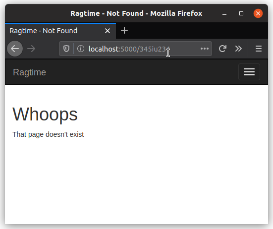

Okay, now for the grand showing of your error page. Remember that base template you made earlier? Let's use it for making a cool looking error page. You can actually kill two birds with one stone, so to speak, as your error handlers are pointing to the same template. Meaning, you can show both kinds of errors, the "not found" and "internal server errors" ones, all in one template file.

```html


{{super()}} {{error_title}}


{{super()}}



{{super()}}
<h1>Whoops</h1>
<p>{{error_msg}}</p>

```

This one is pretty compact and simple, no? The template simply uses everything else from the base template using `extends` and `super()` but adds some extra content to it. In particular, info about the bad stuff that happened. You can see what it should look like below.



Indeed! all the elements from the base template have been carried over to this new error template thanks to template inheritance. The navbar and the styles appear as they did in the user page from before. In this pic, there's also a menu button on the right since the window is physically smaller.

Wanna see the other error message? Well, it'll be hard to see it without learning about a new function in Flask. You'll learn about it in the next section.
