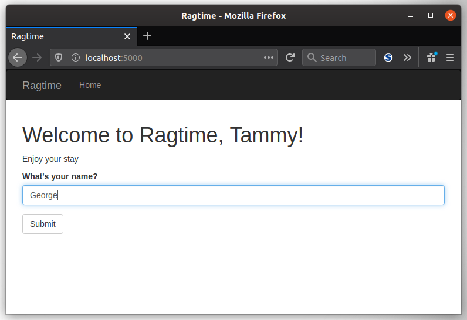
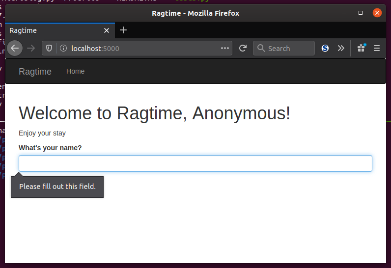

In this lesson, you'll be learning about how to bring your form to life with a view function to render your template. On the last episode of "Rendering Forms: Crime Scene Investigation" AKA the last lesson, the `name` variable was in the template with seemingly no explanation. No one can with the name `name` can answer it, because he or she or they haven't put a name in the `NameForm` yet! Who or what is behind this crime against course-taking students?" Let's stay calm, I'm sure it *might* be answered in this lesson...

### Viewing Your Form

So you have your `NameForm`, you have your template to render the form, and now it's finally time to see it in its natural habitat: on your web browser. For that you'll need to edit your `index()` view function to make your form and pass it to the `index.html` template.

```python
@app.route('/')
def index():
    name = None
    form = NameForm()
    if form.validate_on_submit():
        name = form.name.data
        form.name.data = ''
    return render_template('index.html', form=form, name=name)
```

Aha! And there's `name`! The evidence is piling up, yet at the same time `name` doesn't leave a trace: its value is `None`. This `name` must gets its *true* value somewhere. Let's keep going...

Sorry, this detective stuff is fun. More seriously though, The form gets created here as well, but if the `index.html` template is rendered without a successfully submitted form, the `if validate_on_submit():` block will not execute. It returns `True` only when the form is submitted without errors and is ready to be processed, meaning the data in the form passed all validation by the fields validators. Either way, the form is created and can be rendered whether or not the form submission is successful.

Alright, let's try this out! Get your environment ready and do a `flask run` and pull up your web browser.


[//]: # (Or I could not add this "Method not allowed" stuff and have the students figure it out for themselves if they run into it...)

Wait a sec, what's with this "Method not allowed" message? Of course it's allowed! You just put the form in the view function or method or whatever and told it to render! Why won't it work? Oh, hold on, it's talking about another kind of "method." Add this to your `route` decorator:

```python
@app.route('/', methods=['GET', 'POST'])
```

View functions are only `GET` by default. By adding the `POST` method to the route, it indicates to Flask that the `index()` view function is a handler for both `GET` and `POST` requests. That's exactly what you'll need in order to use a form, as was foretold!

### Requests and GET vs. POST

[//]: # (I realized covering requests earlier might be better, but still conflicted because I'm trying not to write a novel before getting to the actual coding. Don't wanna bore the students)

Little did you know, when the user makes a request, Flask exposes a `request` object that you can access at any time within your view functions. If you did happen to know that, go find someone and ask them to pat you on the back because your course creator said so. Anyway, this `request` object holds a lot of goodies as attributes in the form of dictionaries. They expose all the information the sent by the web browser or client. One of those is `request.form` and contains all the form fields submitted with the request. Remember, the request happens *before* the appropriate view function gets called. In your case, the `form` variable in `index()` grabs the data from `request.form` without you having to do much of anything else.

GET requests *can* be used to send form data to the server, but in practice this is almost never the case. Anyone who wants to expose their submitted information in a URL is free to do so, which is really the only way to handle form data with a GET request. The obvious alternative is to use a POST request. The difference here is that GET requests don't have a body. POST requests do, and the request body contains any form information the client may have submitted. Combine that with cryptographic magic and secret keys that was talked about earlier and you have a much more secure way to exchange information with the server!

Take another look at the `index()` view function. When navigating to the index page `/` of your Flask webapp, the view function gets called after a GET request so that it can render the form and anything else in the template. At this point, the `validate_on_submit()` function returns `False`, because there is no body and therefore no form data. In other words, `request.form` is empty. Once the user on the other end clicks the submit button, *only then* does the request then become a POST request. The `validate_on_submit()` doesn't return `False` right away, but it could when processing and *validating* the form inputs. Once all input is validated, `name` gets assigned the form input data from the `form.name` field, and that gets passed into your template!


If you haven't already, go ahead and try out your form. You'll see that you can easily put a name in, hit submit, and be presented with a nice welcome message with your or someone else's name in it. But if you forget to put a name in, the form will tell you once the page loads again.




___
I think this crime scene investigation has come to a close. Finally, `name`'s alibi has come to light and you are ready to move on to `redirect`s and message flashing. Well done, detective! The next mystery: how to prevent a warning from popping up once refreshing the page...
