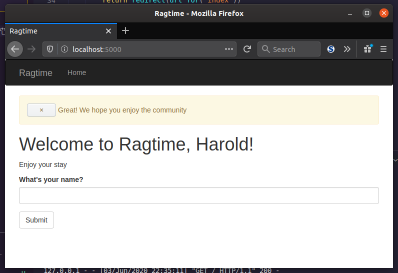

You finally have a form displayed on your index page, but there's a few tweaks you can make to bring the user a more natural experience. These are: redirects to avoid a confusing warning and message flashing to notify the user about various information.

### Redirects

[//]: # (I aim to shorten this section at some point)

No offense or anything, but there's a problem with your current index page. When you enter a name, submit it, then refresh the page manually, you'll see an obscure message that will ask you to confirm before it potentially submits the form again. You get that warning because because browsers repeat the last request they sent upon a manual refresh, which might mean submitting a form *again*.

Why is this bad? Think back to whenever you made a big purchase online, perhaps some fancy Yamaha speakers. You put your credit card info and click submit, but the darn page keeps loading and won't stop! In your desperation, you refresh the browser. Two things could happen should you pursue those speakers: either the server implemented a **redirect** to reload the page without resubmitting the form, or it didn't and you get a surprise on your credit card bill for twice the amount you paid for. Yikes! Let's avoid that kind of scenario altogether by putting in a redirect of your index page.

You never want to repeat a form submission if the user refreshes. You can prevent that with a `redirect()` call. How would you do this? Let's first think about the simpler fix, which you don't have to edit any files for. The simpler fix is to just add a `redirect` at the end of the `if` block of `index()`, like so:

```python
    if form.validate_on_submit():
        # ...
        return redirect(url_for('index'))
```

[//]: # (TODO: Link to course section 5)

That would work, but... what's that? Oh, the `url_for()`? This Flask helper function is a convenient way to generate URLs from within your app. When you type in the name of a view function, Flask will look it up in the app's URL map that Flask creates (discussed in Section 5). So typing `'index'` in here will generate `'/'`, which Flask knows is the index page since you decorated `index()` with `route('/')`. This is great to use if you can never decide or remember which path a view function should handle, because it will always be correct!

Indeed, URL generation is the way of the future! Well, maybe not, but it definitely helps to use in your `redirect()` call, which takes a URL to redirect *to*. Why would you redirect to the same place? That redirect command is clearly going right back to the index page!

It all comes back to the `methods`. When the form loads the first time, before submitting the form, it's a GET request. Once the form is submitted successfully, it's a POST request. Then the user manually refreshes the page. What happens? Read these prophetic words once more:

>browsers repeat the last request they sent upon a manual refresh

That's right, the POST request is repeated. "Submit the form again!" the user is inadvertently telling the browser. To thwart the user from causing his or her own potential destruction, your Flask server can send a redirect after the form is submitted instead of responding back normally. A redirect is in fact a special type of response that contains a URL instead of an HTML string, like `render_template()` ultimately does. Redirects tell the browser to issue a GET request for the URL indicated. So, the redirect's superpower is that it can transform a POST request into a GET request!

### User Sessions

*Hang on*, now there's another problem! Once the redirect happens, what *was* a POST request that could access the form data then becomes a GET request that *cannot*. Because remember, GET requests have no body, and therefore no access to form data! Oh no!

Have no fear, user sessions are here! In fact, they've always been here. The user session is a private storage available to each connected client. Think of it like a bucket of data just for you that allows the application to "remember" things between requests. You, or rather the browser you use, owns the bucket but the application can fill it with data and use that data later. Flask gives you access to the user session in every view function via the `session` object. It acts just like a Python dictionary, and with it you can store away information that you want the application to remember. Let's try it out below along with a redirect!

### No More Amnesia or Double Takes

The new and improved `index()` view function in `hello.py` will look like this:

```python
@app.route('/', methods=['GET', 'POST'])
def index():
    form = NameForm()
    if form.validate_on_submit():
        session['name'] = form.name.data
        return redirect(url_for('index'))
    return render_template('index.html', form=form, name=session.get('name'))
```

Now your users never have to worry about double form submissions, nor do they have to live in fear that the application will never remember their name! Both issues are solved with this implementation. The `name` from before has been replace with `session['name']`, which just means the application puts `name` in your data bucket with the value of whatever you submitted in the form. Then same value is passed into `render_template()` with a call to `session.get()`.

As you can try out yourself with the redirect, hitting refresh after submitting the name doesn't trigger an alert. On top of that, the way you've done it, we can actually visit a different page, then come back and see our name is still there!

### Message Flashing

NEWS FLASH. Sometimes your users forget what they were doing (me) or you need to bring their attention to something important. Or they made a mistake, which happens to the best of us. Showing them some status updates here and there doesn't hurt and in some cases could add some personality to your webapp. The best part with Flask? You don't need an extension for this because it's built in!

Let's try it out:

```python
from flask import flash

@app.route('/', methods=['GET', 'POST'])
def home():
    form = NameForm()
    if form.validate_on_submit():
        session['name'] = form.name.data
        flash('Great! We hope you enjoy the community')
        return redirect(url_for('home'))
    return render_template('home.html', form=form, name=session.get('name'))
```

That was pretty easy. Once the form is validated, the `flash()` function queues a message to be displayed on the next request sent back to the user. Your next goal is to show this new message, and any other flash messages, at the top of the page after the `flash()` message is. While you can *make* messages with `flash()` all you want, without rendering them you'll never see them!

For that, you'll need to add it to a template. (Starting to see the pattern?) Now you might already have your `index.html` template up and you're thinking, "Oh okay, I'll just add it there! What do I have to do?" Hold up, buttercup! If you do that, you'll have to add the rendering for the flash messages in *every other template*. You remember how tedious rendering forms the hard way was, don't you?*

You can save yourself the trouble by adding the flash-message-rendering functionality to the base template, `base.html`. By taking advantage of template inheritance once again, you can display any queued flash messages on any page of your webapp. Since now you understand a bit better, onto the template additions:

```jinja2

<div class="container">
    
        <div class="alert alert-warning">
            <button type="button" class="done" data-dismiss="alert">&times;</button>
            {{ msg }}
        </div>
    
    
    
</div>

```

Flask provides for you a convenient way of getting those queued flash messages through the function `get_flashed_messages()`. What it returns is simply a list of messages. Again, there could be other messages queued that you want the user to see also, so that's why you should use a `for` loop to iterate over them. For now you should only be generating one each time the user submits the `NameForm`. Making use of Bootstrap styles, you can make a popup that shows the message with an 'x' button to dismiss it. One more note: once `get_flashed_messages()` is called, it clears its queue of messages, and the same message will not appear again unless `flash()` is called again for said message.



___

Now you are a master of redirection, user sessions, and message flashing! In the next lesson or two, you will practice all that you've learned from this section.
