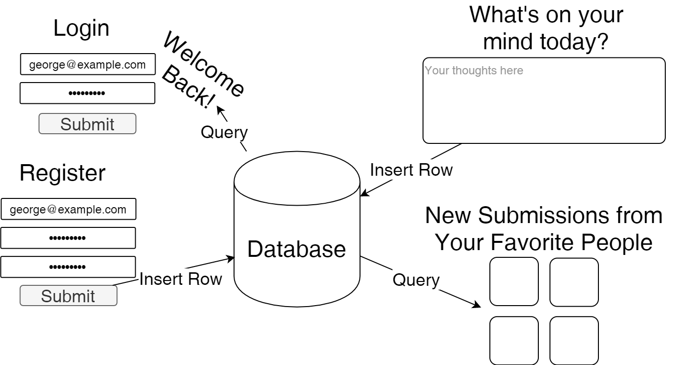
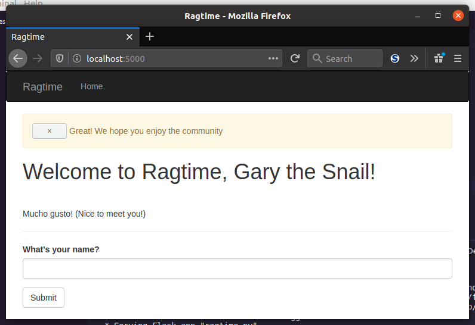
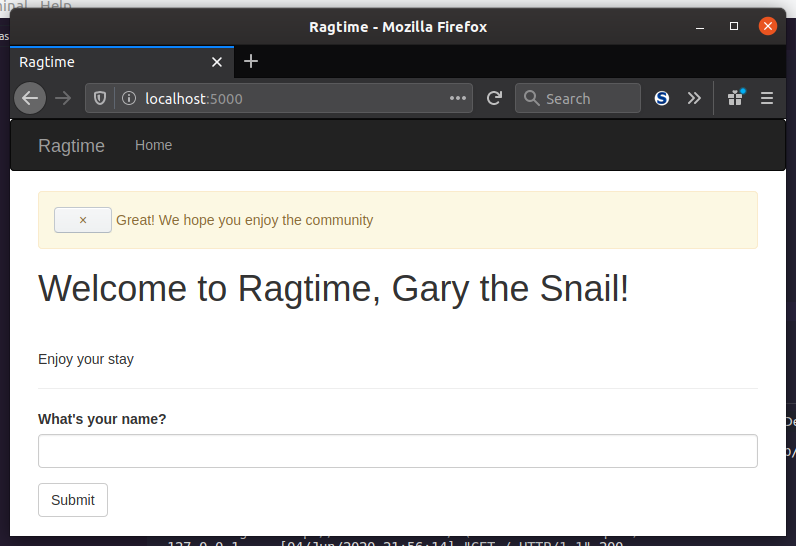

You have become familiar in the art of database sessions and querying your data, and now you are ready to apply this knowledge to your view functions. This may have an obvious answer or seventeen, but why would you *want* to use database operations in a view function?

### How Exactly Is This Useful?

You have your database in the backend, and you have your user-facing webpages. How do these two relate to each other, and what does that look like? How does data flow from one to the other and vice versa?

Imagine a website like Twitter. When you navigate to www.twitter.com, you are presented with all kinds of content. Do a search for "sandals" and you may see more feet than you bargained for, but what happened was that data had to be *queried* from one or more of Twitter's databases. You want to make a new account, so you go to register one. Hitting submit adds your new account to their database. Then when you log in, Twitter queries for your information and verifies your credentials against what they have on record. You make a tweet, add a few hashtags and some mentions... along with a new row in the "tweets" table, there's a whole soup of queries waiting to happen in just that one tweet! The tags lead to ever more searches and the mentions lead to even more users.



As a webapp developer with a database and a frontend, it's inevitable that you'll need to do very similar things as Twitter. Get registration info, record it. Accept user credentials, query the user with that email and see if the password matches. Accept content from the user like information on their newest song, and that needs to go in the database, too. While it's good to think about now, you'll worry about all that stuff a bit later.

### Add Users From Index Page

Now, the answer to why has been made clear. To illustrate what this might look like in code, you can make use of your `NameForm` to put data into the database if it doesn't already exist.

```python
@app.route('/', methods=['GET', 'POST'])
def index():
    form = NameForm()
    if form.validate_on_submit():
        name_entered = form.name.data
        user = User.query.filter_by(username=name_entered).first()
        if user is None:
            user = User(username=name_entered)
            db.session.add(user)
            db.session.commit()
            session['known'] = False
        else:
            session['known'] = True
        session['name'] = name_entered
        flash('Great! We hope you enjoy the community')
        form.name.data = ''
        return redirect(url_for('index'))
    return render_template(
        'index.html',
        form=form,
        name=session.get('name'),
        known=session.get('known', False))
```

Let's untangle this as there has been a few modifications. Starting from the beginning, once a name is entered and submitted, the name gets captured in `name_entered`. Now the fun begins: the database is checked to see if a `User` with that username already exists. If it does, a new `known` variable is written to the user session. After the redirect, the `known` will be, well, *known* to the template. If the `User` doesn't exist, a new `User` is added to the database and `known` is `False`.

### Template With A Customized Greeting

With the new and improved view function, you can add a nice personalized greeting based on if the user is `known` or not.

```jinja2
% extends 'base.html' %}


Ragtime


<h1>Welcome to Ragtime, {{name}}Anonymous!</h1>
<div class="page-header">
    
    <p>Mucho gusto! (Nice to meet you!)</p>
    
    <p>Enjoy your stay</p>
    
</div>
{{ wtf.quick_form(form) }}

```

Once you get that all done, you should have a pretty cool app that "knows" which names it's seen and which ones it hasn't! Trying the name "Steve" in the form and hitting submit will result in a page that looks something like this:



If "Steve" comes around to the site again and says hello with his own name once more, he'll be greeted with a new message:



___

And there you have it, a real working database in harmony with a webpage, as if seven angels were singing in unison. But your simple database will not stay so simple, there will be more to build going forward. So how can you possibly *keep* your data without having to nuke your tables just to update them with additional columns? You'll learn about "migration" next, as soon as you migrate to the next lesson!
