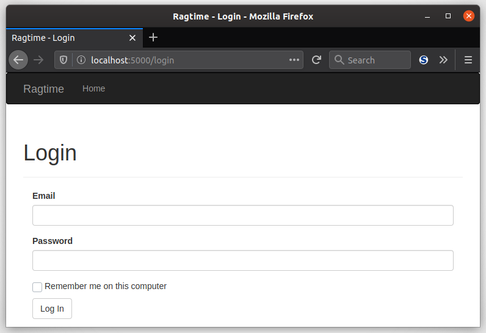
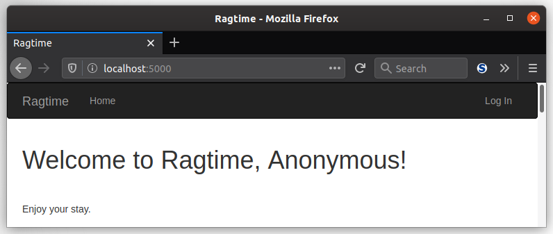
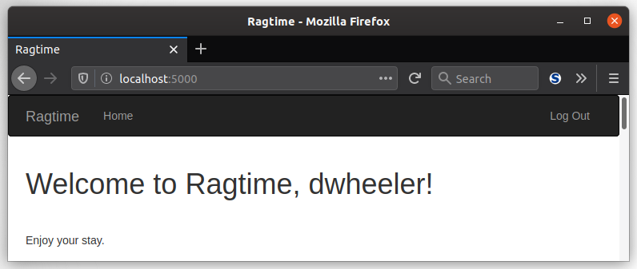
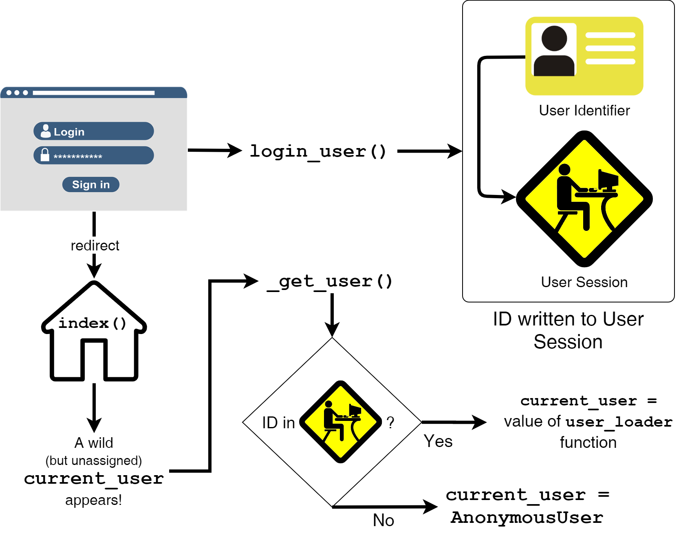

With that login form you just made, you're ready to use it now to sign in your first user! Let's get everything else in place.

### Hold Up!

Before you get too far, you'll need to add one more column to your `User` model. This is a column for their email since people usually remember that versus the possibly of hundreds of usernames they use on other sites. (Please don't be like me and use hundreds of usernames on other sites...)

```python
class User(UserMixin, db.Model):
    # ...
    email = db.Column(db.String(65), unique=True, index=True)
```


### Logging In

Previously, you also made a mostly empty `login()` view function in `views.py`. Go back to it because now you have plenty for it to do.

And because we at CodingNomads care about your learning, some of this functionality is hidden away. ;) Don't worry, there's a few hints. But for the stuff you haven't learned about yet, that is below.

```python
from flask import render_template, redirect, request, url_for, flash
from flask_login import login_user
# a few more imports ;)

# route to '/login'
def login():
    # form is created
    # form is validated...
        # Query the database for the user
        # if the user exists and the password is correct...
            login_user(user, form.remember_me.data)
            next = request.args.get('next')
            if next is None or not next.startswith('/'):
                next = url_for('main.index')
            return redirect(next)
        # flash a message that username/password is invalid
    return render_template('auth/login.html', form=form)
```

Of course, you'll need your `login()` view function to create the form, and the `login.html` template will render. A GET request is sent to see the page, then the user types in their info, presses submit and a POST request is sent to the `/login` page. Assuming the user exists and the password is right, then the logging in takes place.



Flask-Login's `login_user()` function is called, and it takes a `UserMixin` object as it's first argument. But since your `User` model *is* a `UserMixin` you can pass in the `user` that comes from your database query. The next argument is whether or not the user should be remembered even after the browser window is closed. `True` means yes, do "remember me" after the browser is closed. Technically, that means a long-term cookie is to be set in the user's browser that Flask-Login can load later on to restore the user session.

As you've learned before about GET and POST, you'll want the entire request to end in a GET, so that's why a `redirect()` is used. However, if the user got to the login page from another restricted page, you'll want to take them back to that page once they log in successfully. Otherwise, they'll get redirected to the index page. In the first case, Flask-Login will actually set the `next` query string argument to the page the user tried to visit. Remember, the query string comes after the *path* in the URL. It can be accessed using the `request.args` dictionary, so before a redirect happens, you can see if a `next` page is specified and that it's a */relative* path and redirect there, otherwise just redirect to the home page.

[//]: # (TODO: Did I talk about the query string before?)
[//]: # (TODO: talk about all request attributes briefly)

Finally, if the email or password don't match, the user is shown a flash message telling them so.

### Logging Out

Logging out is pretty simple. You can customize it with your own personal logout message, too. It's your app, after all!

```python
from flask_login import logout_user, login_required

@auth.route('/logout')
def logout():
    logout_user()
    # flash message to indicate the user logged out
    return redirect(url_for('main.index'))
```

Flask-Login's `logout_user()` function is a simple call with no arguments and it logs out the currently signed-in user. In geek-speak, Flask-Login will remove and reset the user session.

### Changes To Templates

To enable a user to login from the home page, you can edit `base.html` to add a link to the navbar:

```jinja2
{# ... #}
<ul class="nav navbar-nav navbar-right">
    
    <li><a href="{{ url_for('auth.logout') }}">Log Out</a></li>
    
    <li><a href="{{ url_for('auth.login') }}">Log In</a></li>
    
</ul>
{# ... #}
```



The `current_user` context variable is a convenient way to access the current `User` that is logged in. It's automatically available not only for templates, but also for view functions. If there's no user logged in, then the `current_user` is an `AnonymousUser` object.

Then, the `index.html` template can be updated to allow you to see that login functionality for your website works:

```jinja2
{# ... #}
Hello,

    {{ current_user.username }}

    Anonymous
!
{# ... #}
```

### Test Your Login!

Before you can test a login, you need a login to login with first! If you don't already have a user with an email, password, and username, you can add one to your database with `flask shell`:

```python
(env) $ flask shell
>>> u = User(email='paul@example.com', username='john', password='corn')
>>> db.session.add(u)
>>> db.session.commit()
```

Now you should be all set to test your login. Launch your Flask app, then navigate to `'/auth/login'` manually or though the "Log In" link you just made. Then, log in as your user and watch as you are greeted! Feels warm and fuzzy, doesn't it?



### How Flask-Login Works

Flask-Login is pretty simple. Deceivingly simple... What's it *really* doing? What's actually going on under the Flask hood? The operation goes like this:

1. A user finds their way to the login page, `https//:localhost:5000/auth/login`, by clicking "Log In" on the navbar.
2. After the user submits the login form, the same handler is called again but now with a POST request.
    a. Once the credentials are verified, the `login_user()` Flask-Login function is called.
    b. The `login_user()` function loads the ID of the user as a string into the user session.
3. When the user login is successful, a redirect to the index page is returned. Once the browser receives the redirect, it requests the index page.
4. The rendering of the Jinja template for the index page is triggered.
    a. While rendering, the `current_user` context variable appears for the first time.
    b. The `current_user` variable doesn't "know" yet which user is actually the current one, so it calls Flask-Login's internal `_get_user()` function.
    c. The `_get_user()` function checks to see if there's a ID stored in the user session. If there is, it returns the value of the function decorated by `user_loader`. Otherwise, it returns an instance of `AnonymousUser`
    d. The new value of `current_user` is now defined and the `index.html` template can render it.



### Unit Tests

Coming soon.

___


You are now quite familiar with the ins and outs of Flask-Login, the piece-of-cake Flask user management extension! You're probably wondering how you can let users make their own accounts, so let's get right on that in the next lesson.