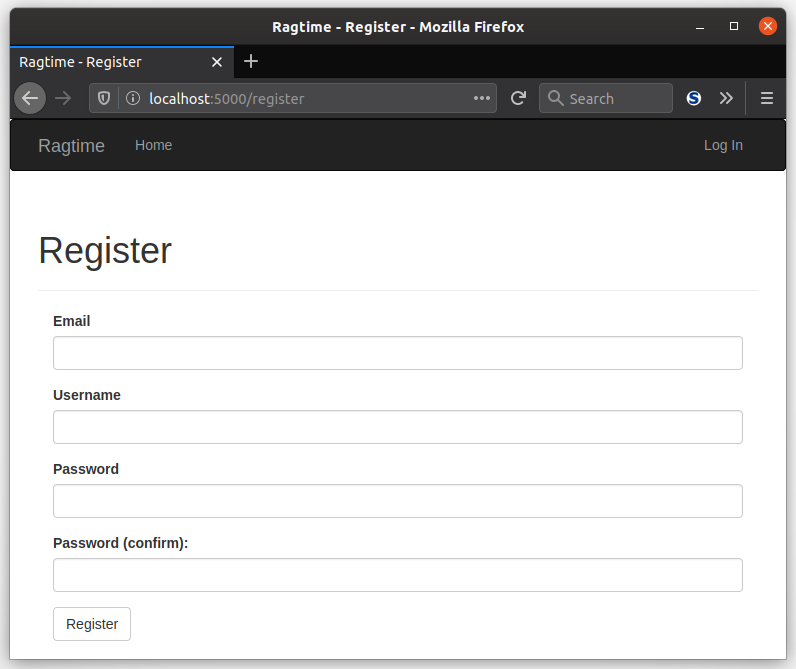

Take a deep breath, the worst of user authentication is over. But if you thought there'd be no more practice with this tool or that concept, you'd be wrong! (You didn't think that, right?) There's just one more thing to do and that's to fill out your `register()` view function.

### Instructions

If you haven't already, you'll want to make your `auth/register.html` template now. Then, pull up your `app/auth/views.py` file and get to coding. Here are the guidelines for what needs to happen:

1. Display your `RegistrationForm`
2. Upon a POST request, validate the form
3. After the form is validated, create the `User` based on the info provided and add it to the database.
4. Flash a message that the user can now login, then redirect them to the login page.

___

There's plenty of *validation* in your registration, but not much *verification*. What if the user's email isn't even real? Or \*gasp\* not owned by that person!? In the next section, you'll learn about Flask-Mail, sending emails, and verifying users with confirmation tokens.

<strong>Note: </strong>Now is a great time to perform a database migration! And don't forget to check the script to make sure all your changes from the last two sections are taken into account.

