Now it's time to set up your secondary account. If you already have a Gmail account you want to use, you can skip the account  part and only worry about the SMTP configuration. A secondary account is useful to just fart around with, and best of all, you don't have to risk your own security with your personal email. One more thing: you don't have to use Gmail! Instructions for setting up SMTP may vary, though.

### Create The Gmail Account

The first step is to make a new account that will be used to send and receive emails programmatically.

#### 1. Visit The Homepage

Head over to the <a href="https://www.google.com/gmail/about/" target="_blank">Gmail Home Page</a> and click "Create an account."

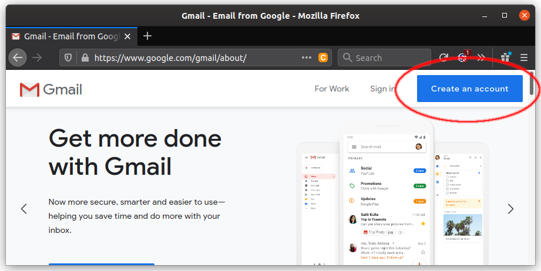

#### 2. Enter Account Details

Then you'll be presented with a page where you'll enter your account information. The username/email you'll use must, of course, be unique across all of Google. To prevent you from spending too much time thinking of the perfect username (only to have it say it's taken) is to use a name like this:

```flaskwebdev.<your name and/or initials here>```

You can use any "First name" or "Last name" you want, as long as it's rated PG-13 or below. ;) Then the password. You probably know this, but make sure you write it down!

#### 3. Settings

Keep going through the steps to set up your account. Once you're done, you'll be presented with your new inbox. There should be a gear to the right, click that. Then choose "Settings."

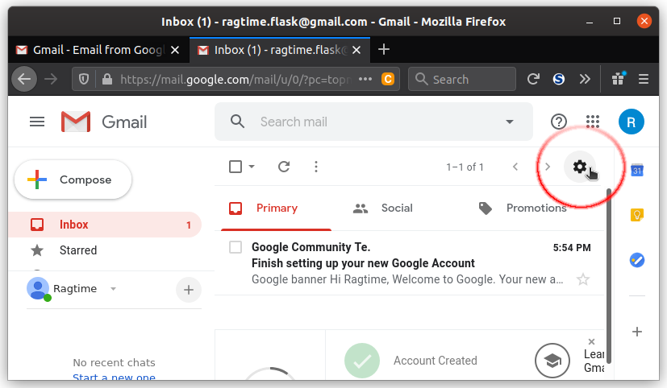

#### 4. Other Google Account settings

Then once you're in Settings, click the "Accounts and Import" tab and click "Other Google Account settings."

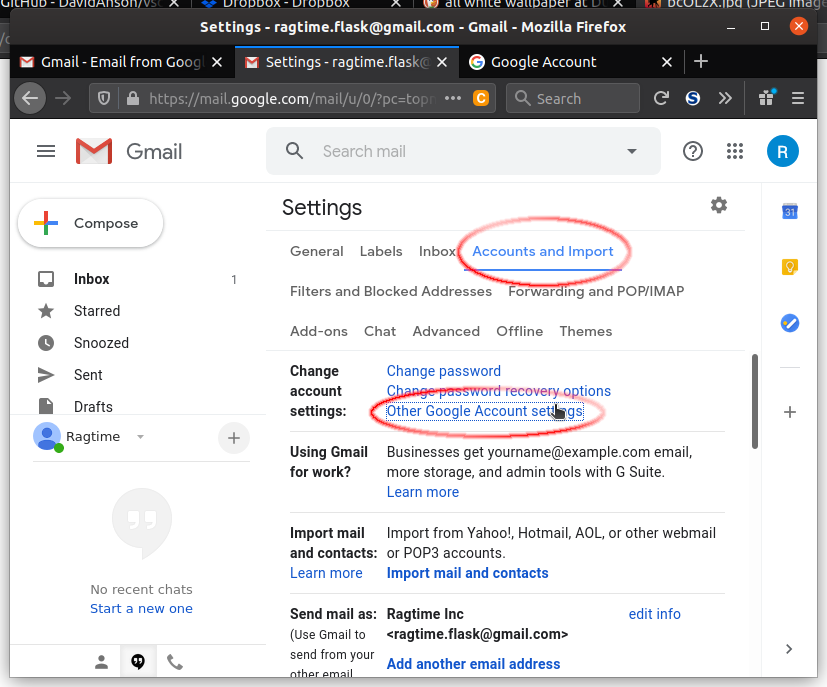

#### 5. Turn Less Secure Apps ON

Once you get to the next page, click the "Security" tab.

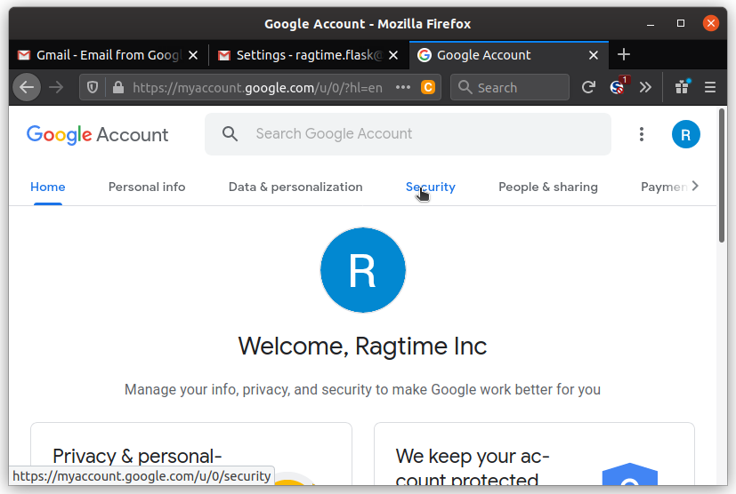

With the Security tab open, scroll down to "Less secure app access", then click "Turn on access."

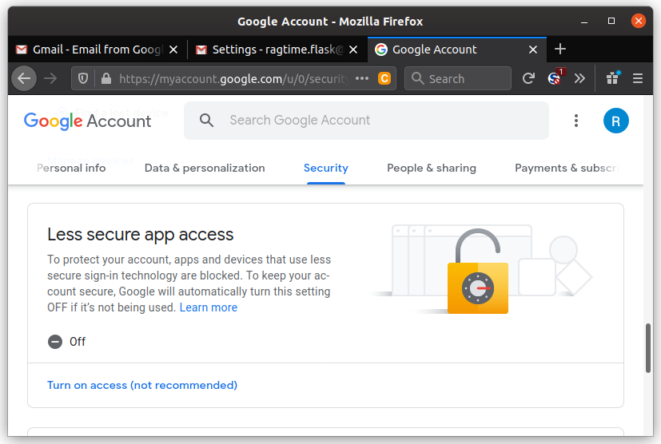

Then, turn "Allow less secure apps" to ON. This is required in order to send emails from your Flask App.

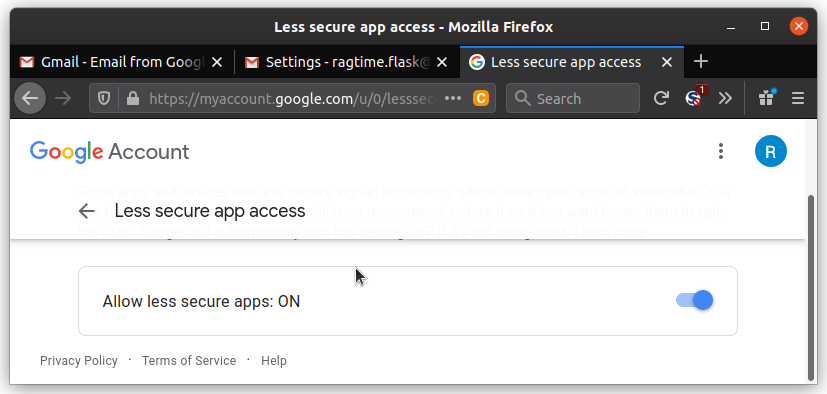

#### 6. Two-Factor Authentication

Next, you'll need to enable two-factor authentication. This is required to enable app passwords, which is what you'll do next. Click "2-Step Verification" (which is the same thing as two-factor authentication).

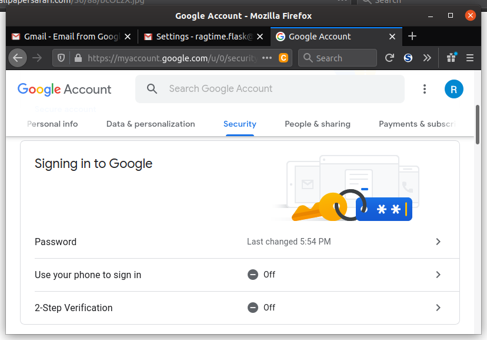

Then, you'll need to type in your phone number to use as a device to get your security codes to sign in with, in case it's needed. You can also choose a phone call, security key, or Google prompt. You may also be able to use Google Authenticator if you prefer that.

<div class="alert alert-warning" role="alert"><strong>Note: </strong>The instructions for Google Authenticator are not provided here.</div>

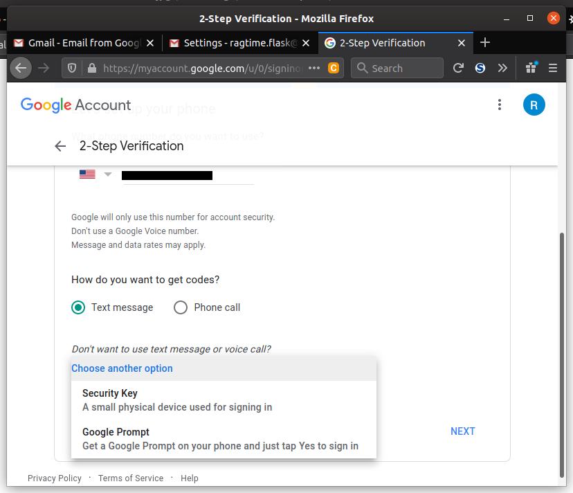

Once you enter the code successfully after clicking "NEXT," go ahead and click the back button **next** to "2-Step Verification."

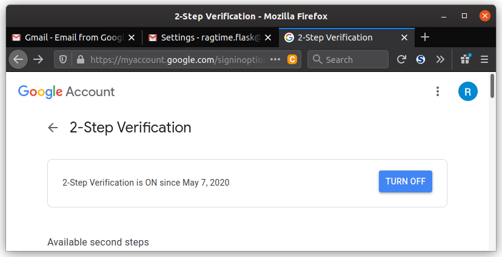

#### 7. App Password

After setting up two-factor authentication, scroll back down to "Signing in to Google." Click "App passwords."

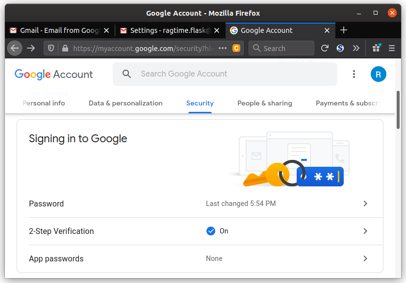

Then on the next page, where it says "Select device," click it and choose "Other (Custom name)." Then type in something like "flask-webdev" for the name.

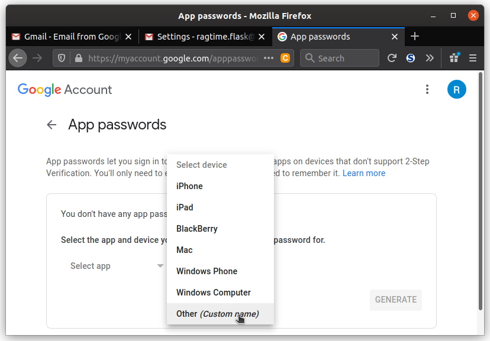

Once you click "GENERATE," you'll be presented with a 16 character code. That's your new app password! Yes, your *Flask app* app password. And, yes, *you'll want to write it down*. ;) You will need this password in order to authenticate with Google's SMTP server and, therefore, be able to send emails.

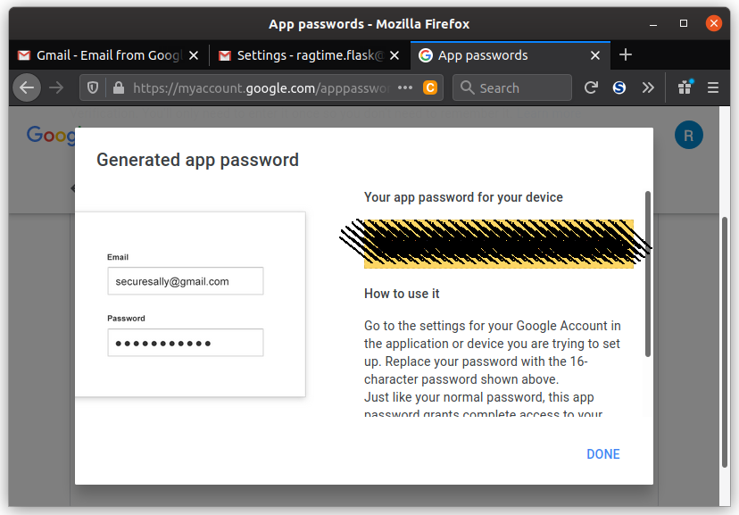

### Now You're Ready!

Great, now all the boring account-creation stuff is done. You're ready to set up Flask-Mail to send email to your users and receive notifications about events that occur within your app. On to the next lesson!
