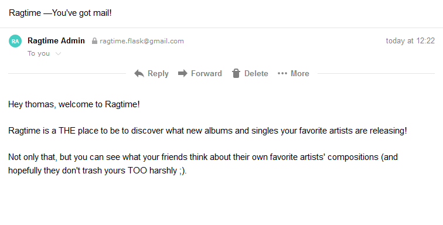

Back in the early 1860's, the Pony Express operated in the United States to deliver all kinds of messages and mail, by horse, from California all the way to Missouri. At the time, it was a godsend because it reduced the amount of time for messages to be sent across the country. But today, you don't even need a pony. All you need is Flask-Mail, an email account, and a few lines of code to deliver thousands of messages a day. Knowing that, no one needs a pony.


### Functional Email Sending

"Functional" meaning you'll encapsulate your email-sending functionality in a function! (There I go again with too many variations of the same word in one sentence...) Anyway, make a new file named `email.py` in your `app` package (`app/email.py`). Here's the code to make a convenient email-sending function called, what else? `send_email()`:

```python
from flask import current_app, render_template
from flask_mail import Message
from . import mail

def send_email(to, subject, template, **kwargs):
    msg = Message(
        subject=current_app.config['RAGTIME_MAIL_SUBJECT_PREFIX'] + subject,
        recipients=[to],
        sender=current_app.config['RAGTIME_MAIL_SENDER'])
    msg.body = render_template(template + '.txt', **kwargs)
    msg.html = render_template(template + '.html', **kwargs)
    mail.send(msg)
```

This function takes a recipient, a subject, the name of a template (without extension) to send as the body, and keyword arguments for the template parameters. It uses Flask-Mail's `Message` class to create an "email" object. The `Message` takes the subject, which is combined from the prefix defined in the last section and the subject passed in. The recipients argument accepts a list of email addresses. The sender is then simply the sender name and email address you also defined in the last lesson.

Then comes the message body, and you can utilize the `render_template()` to do the work for you. "Templates can be used to send emails, too?!" I heard you shout at your computer screen. That's right: Jinja2 is a *templating engine*, so you can make virtually any kind of document out of, including text files. There are two kinds of email bodies that are defined here, which is the text body and the HTML body. In case the HTML email gets rejected by an email provider's spam filter, the text email can be received by the recipient instead.

### Make Your Templates


It's arts and crafts time! Well, for textual templates, anyway. This is your turn to make both:

1. a welcome email for registered users, and
2. a notification email for the app admin (you) that a user registered

You can have these emails say whatever you want. You'll create two files for each email, a `.txt` file and a `.html` file. Those will be your templates. Put them in `templates/mail/`. Call them `welcome.txt`/`html and `new_user.txt`/`html`. They'll say something like "Welcome, {{user.username}}!" and "A new user, {{user.username}}, signed up at {{time}}". You are encouraged to use a `User` instance to get details about said user in your template. But again, it's your choice what these email messages say. :D

Making a text file template works the same way as an HTML template. You use placeholders and create control structures the same way you would an HTML template. Once you're done, you'll get to try it out in a flask shell session!

<div class="alert alert-warning" role="alert"><strong>Note: </strong>Your templates should look very similar. The only difference really being that the text file doesn't have HTML tags. Use the same placeholders in your templates so that you don't get errors with your keyword arguments.</div>

### Send an email

Now it's time to give sending an email a shot. With your new `send_email()` function and a template message or two, you're ready.

Whip open a flask shell session and try it out. To see that your email code works and actually sends an email, you can put an email address you have control of for the recipient. A fake one is used here:

```python
(env) $ flask shell
>>> from app.email import send_email
>>> # If you don't already have a user in your database,
>>> # go ahead and make one on the spot
>>> u = User(username="thomas", email="thomas@example.com", password="corn")
>>> send_email(u.email, "You've got mail!", 'mail/welcome', user=u)
```

If it worked, you'll get output like this:
```
send: 'ehlo [127.0.1.1]\r\n'
reply: b'250-smtp.gmail.com at your service, [71.211.182.93]\r\n'
reply: b'250-SIZE 35882577\r\n'
reply: b'250-8BITMIME\r\n'
reply: b'250-STARTTLS\r\n'
reply: b'250-ENHANCEDSTATUSCODES\r\n'
reply: b'250-PIPELINING\r\n'
reply: b'250-CHUNKING\r\n'
reply: b'250 SMTPUTF8\r\n'
reply: retcode (250); Msg: b'smtp.googlemail.com at your service, [71.211.182.93]\nSIZE
...
reply: b'221 2.0.0 closing connection t25sm2354630iog.19 - gsmtp\r\n'
reply: retcode (221); Msg: b'2.0.0 closing connection t25sm2354630iog.19 - gsmtp'
```

Notice that in the `send_email()` function, you use the `'mail/welcome'` template *without* an extension. That's because your new function automatically tacks on the extensions for sending the HTML version, or if that doesn't work, the text only version. But holy crap, you just send an email! Here's one I got as an example:



That message actually went to spam, so be sure to check that folder. There are ways to prevent your messages from going to people's spam folders, but that's outside this course's scope.

### Your Turn Again: Notifications and Welcome Messages

Let's put that `send_email()` function to actual use, shall you? Because you're just starting out with a Flask web app, it would be exciting for you to get an email whenever someone registers an account with your totally rad site. But there are other reason for getting emails about the state of your app, as was alluded to above. And of course, why not welcome your user once they register?

Pull up your `register()` view function and take a look at it. Where would you put your `send_email()` functions? That's right, *functions*. You have two template messages, one for welcoming a new user called `welcome` and the other as a notification for yourself called `new_user`. The first will go to your user's email, and the second will go to your app's admin email.

Then once you put that functionality in, test it out! Try registering an account with your own email address for your user to make sure it works. If you're having trouble, remember you have the CodingNomads forum and perhaps your mentor to help you out.

___

Once you get to the point where you can send emails with the click of the registration submit button, well done! Now you're ready to learn about generating confirmation tokens for your users.