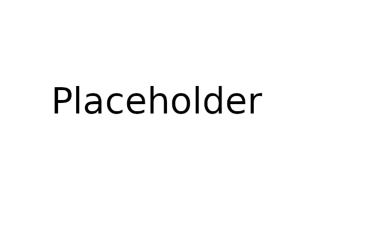

You can generate tokens, but to put those tokens to use requires some additional code. In this lesson, you'll make the changes necessary to send new users an email with a token, require them to verify their email before using the rest of the site, and allow them to resend confirmation emails.

### The Confirmation Link

What exactly is the confirmation link? All the view functions you've seen thus far have something for the user to, well, *view* through the rendering of a template. The index page, where you welcome your users, plenty of view functions for displaying and processing forms, and basic user profile pages. But what is there to *view* in a confirmation page? A page that says, "Yo, this is the confirmation page, please enjoy this picture of an ostrich while we process your confirmation?"


The ostrich in question, last seen heading eastbound.

Keep in mind your view functions don't have to show anything at all. At the end of the day, all they are doing is handling a request. A *request* by the user to confirm their account can be processed by your app without showing any ostriches, and then *redirect* the user to another page once the processing is complete.

So now that this fact is drilled into your brain, let's try it out. The `confirm()` view function in `app/auth/views.py` will take a token, attempt to confirm the user, then redirect to the home index page:

```python
@auth.route('/confirm/<token>')
@login_required
def confirm(token):
    if current_user.confirmed:
        flash("You're already confirmed, silly!")
        return redirect(url_for('main.index'))
    if current_user.confirm(token):
        db.session.commit()
        flash('You have confirmed your account! Thank you.')
    else:
        flash("Whoops! That confirmation link either expired, or it isn't valid.")
    return redirect(url_for('main.index'))
```

Note that you will want to see if the *current* user, `current_user` is confirmed, because we don't want this function to confirm any old user. And remember, the token cannot be decoded if the token doesn't match the user session signature.

Starting from the beginning, you wouldn't want to reconfirm a user if they are confirmed already. A redirect is performed early in that case. But if not, the token is processed and if it goes through, *the database session to add the user is then committed*. In the last lesson, the `confirm()` `User` method only updated the user within the session, so this step writes it to the database for real. An invalid or expired token will still ultimately result in a redirect.

### Register. Receive Email. Confirm.

With your new token generation and email sending capabilities, the time has come to combine them! Pop open your `register()` view function once again.

This time around, you'll again make sure the user registration information is valid, then you'll `generate_confirmation_token()` for that user. Once you create a `token`, you'll `send_email()` with a template to create the confirmation link inside the email. Get it?

And one more thing: just like your welcome and new user notification emails, you're mission is to create that template. It's to nicely ask your users to pretty please confirm their account. Like last time, make a text template and an HTML template.

Unlike the last time, you'll put your templates in the `templates/auth/email` directory, and call them `confirm.txt`/`html`. Technically, this email will be *part* of authenticating your users, so that's the logic behind it.

And one thing you should know: in your templates, you will need to use the `url_for()` Flask method to point to the new `confirm()` view function you made above, and pass in the `token` that way.

<div class="alert alert-warning" role="alert"><strong>Note: </strong>The <code>url_for()</code> Flask method accepts a keyword argument <code>_external</code>, which is a boolean. Set this to <code>True</code> to so that the URL is *fully qualified*, meaning it includes <code>https://</code> or <code>http://</code>, the hostname, and the port. Otherwise, your user will be pointed to a confirmation link that doesn't work!</div>

### "YOU SHALL NOT PASS... Unless you confirm your account, kthxbye"

(Never thought I'd use "kthxbye" in a lesson heading, but there I go proving just how eccentric I am. Oh well. You probably already knew that.)

Ahem... Anyway, the point of this series of paragraphs is to teach you how to *block* users from accessing any other page until their email is confirmed. Politely, of course. You *want* to let them in, but rules are rules. You *could* just tack on a `login_required` decorator to each and every view function, but what if you make a new view function and forget to apply the decorator to that one? Why even worry about it?

That's kind of what the `before_app_request` decorator was made for. This is somewhat similar to an `app_errorhandler` decorator it is a *special* kind of route in that the function it is applied to doesn't need a separate `route` decorator. It also applies app-wide. Now onto what it actually does. As can be implied from the name, the function decorated with `before_app_request` is called *before* every request. That means *before* any view function is called. If the before-request handler returns a response or redirect, it will intercept any view function that was to originally going to be invoked.

You can tack the `before_app_request` callback onto a new function in the `app/auth/views.py` file to prevent unconfirmed users from accessing another page and instead present them with an "please confirm first!" page.

```python
@auth.before_app_request
def before_request():
    if current_user.is_authenticated \
            and not current_user.confirmed \
            and request.blueprint != 'auth' \
            and request.endpoint != 'static':
        return redirect(url_for('auth.unconfirmed'))


@auth.route('/unconfirmed')
def unconfirmed():
    if current_user.is_anonymous or current_user.confirmed:
        return redirect(url_for('main.home'))
    return render_template('auth/unconfirmed.html')
```

There are several conditions that will trigger the user to be redirected to this new `'/unconfirmed'` route.

1. The user must be logged in, as in `current_user.is_authenticated` is `True`
2. The user has not confirmed their email
3. The blueprint that handles the original request is not the `auth` blueprint (you'll still want to allow them to confirm their account!)
4. The request is not for a static file (in `app/static`)

Then the `unconfirmed()` view function handles showing the user the "please verify!" template, unless they happen to not be logged in or they already confirmed their account.

### "Your Account Is Unconfirmed" Template

As you may have guessed, you'll need to create yet another template that asks the user they can't use the site until they verify their account. This one is easy, though. Just let them know they still need to verify their account. But don't forget to let them have the app resend a new verification code! Call this template `unconfirmed.html` as in the above view function.



___

Coolio, now you should be all set to welcome and then ask your users to confirm their new accounts! But while testing this, haven't you noticed your app get a teensy bit slower? Find out why in the next lesson.

