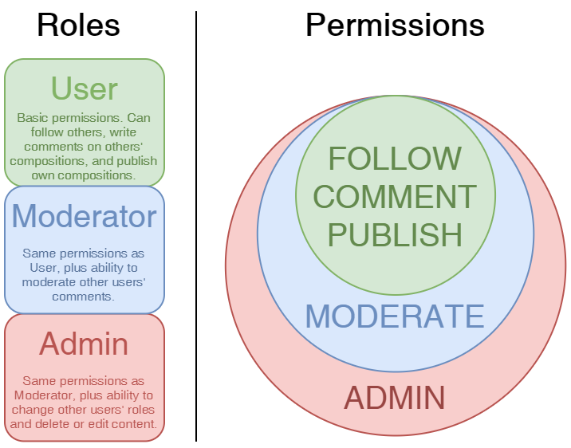

You know what roles mean when it comes to a webapp and how users fit in. In this lesson, you'll put your database knowledge more to the test and learn about how to represent roles in your database.


What's your role?

### Improved Roles

Back in the section on databases, you made a simple `roles` table that only had role names and a one-to-many relationship with users. It's now time for an upgrade, and the first thing you'll do is add a new `permissions` column. Open up `app/models.py` and plop these changes in:

```python
class Role(db.Model):
    __tablename__ = 'roles'
    id = db.Column(db.Integer, primary_key=True)
    name = db.Column(db.String(64), unique=True)
    default = db.Column(db.Boolean, default=False, index=True)
    permissions = db.Column(db.Integer)
    users = db.relationship('User', backref='role', lazy='dynamic')

    def __init__(self, **kwargs):
        super().__init__(**kwargs)
        if self.permissions is None:
            self.permissions = 0
```

First, let's talk about `permissions`. Recall in the last lesson the permissions model you'll be using. This new integer column is a very concise way of representing the permissions the user has. Instead of having different columns for each permission a user could possibly have, the combination of permissions can be represented by a number. If you know anything about binary numbers, you might have an idea of how it works. If not, it'll be covered in just a little bit! ;)

[//]: # (TODO: Explain why this doesn't this set permissions to 0 -> default=0)

A constructor is also added. Along with inheriting the base class's construction, it's other purpose in life is to set `permissions` to 0 by default. This is to override *SQLAlchemy's* default value of `None`.

The other column is `default`. This is a boolean value that will have a value of `True` only for *one* role. That role will have a set of permissions that can be applied automatically to new users *by default*, unless the user meets certain conditions. Thus, that is why it's useful to have a `default` column, so that you don't need to define extra logic just to figure out who gets what permissions on a per user basis. In other words, if a new user is a normal user (which they almost always are), they can do normal user things with normal user permissions.

### Permissions

"Yada yada yada. You keep saying 'permissions,' but what are they exactly?!" Yes, you're right. **Permissions** are, in short, separated into certain tasks that your users can and can't do. Here's what you should expect users to be able to do in your app:

| Task                                        | Permission Name | Value |
| :------------------------------------------ | :-------------- | :---- |
| Follow other users                          | `FOLLOW`        | 1     |
| Comment on compositions made by other users | `COMMENT`       | 2     |
| Publish compositions                        | `PUBLISH`       | 4     |
| Moderate comments made by other users       | `MODERATE`      | 8     |
| Administrate users and content              | `ADMIN`         | 16    |

For an app like Ragtime, this is what you might expect users to be able to do, but your permissions can be slightly different if you'd like. For example, maybe you wanted to make a shopper's social network instead. Your permission names could be `FOLLOW`, `REVIEW`, `ANNOUNCE`, `MODERATE`, and `ADMIN`, to represent giving users the ability to review a store or announce a new product for their own store. You can also expand what tasks a user is able to do with a given permission, like allowing users to comment both on compositions *and* on users' pages. The point is, there are options! **For now**, it's advised you stick as close to the permissions listed above as possible. While much of this is arbitrary, this permissions model will allow you to build a pretty sweet app.

Looking at that table again, each task has an associated permission name and a value. The permission name is the name you'll give the permission in Python. It's all caps because the values are constant and aren't supposed to change. The value is *not* arbitrary, and as was hinted at before, it's got a binary pattern to it. Just for fun, and because your Flask course creator is a total nerd, let's represent all of those values as binary numbers (base 2):

| Permission Name | Decimal Value | Binary Value |
| :-------------- | :------------ | :----------- |
| `FOLLOW`        | 1             | `00001`      |
| `COMMENT`       | 2             | `00010`      |
| `PUBLISH`       | 4             | `00100`      |
| `MODERATE`      | 8             | `01000`      |
| `ADMIN`         | 16            | `10000`      |

Looks like a weird game of Connect Four, or in this case, five. But yes, all those 1's appear diagonal. If you add, say, `FOLLOW` and `PUBLISH` in binary you get `00101`, or 5 in decimal. Basically, you can represent *all* the combinations of permissions as one number and goes up to 31. Cool, huh?

[//]: # (I think I maybe went overboard with this lol)

Alright, before I get too carried away, here's the new class to represent all this. The class doesn't need to be a `db.Model` because :

```python
class Permission:
    FOLLOW = 1
    REVIEW = 2
    PUBLISH = 4
    MODERATE = 8
    ADMIN = 16
```

### Manipulating Permissions With Ease

To make your life easier when dealing with permissions in your app, you can encapsulate things like "give user X permission" and "reset all user permissions" in a few functions. These will go in the `Role` model, since a role is a set of permissions (and since, y'know, you already have a `permissions` column):

```python
class Role(db.Model):
    # ...
    def add_permission(self, perm):
        if not self.has_permission(perm):
            self.permissions += perm

    def remove_permission(self, perm):
        if self.has_permission(perm):
            self.permissions -= perm

    def reset_permissions(self):
        self.permissions = 0

    def has_permission(self, perm):
        return self.permissions & perm == perm
```

Pretty straightforward stuff here, but let's go through them. You've already seen an example of "adding" permissions. The `add_permission()` goes the extra step of checking that the user doesn't already have the permission, so that the number doesn't go past 31. The `remove_permission()` is similar, and `reset_permissions()` just clears everything.

The `has_permission()` method is a bit complex. It uses the bitwise AND operation to check if a user has a permission. Thinking back to binary stuff, say a user has a permission value of `00101` (`FOLLOW` and `PUBLISH`). Checking if they have the `PUBLISH` permission would look like like:

```python
user.role.has_permission(Permission.PUBLISH)
```

In binary, what happens is the operation `00101` AND `00100` == `00100`, which returns `True`. If you're not familiar with binary, it just means that the middle 1's line up. Using a Flask shell session, you can play around with these methods:

```python
(env) $ flask shell
>>> r = Role(name='User')
>>> r.add_permission(Permission.FOLLOW)
>>> r.has_permission(Permission.FOLLOW)
True
>>> r.remove_permission(Permission.FOLLOW)
>>> r.has_permission(Permission.FOLLOW)
False
```

And so on.

<div class="alert alert-warning" role="alert"><strong>Note: </strong>Don't forget to add your new `Permission` class to the `shell_context_processor`!</div>

### Just Role With The Permissions

Here's who'll get what roles:



But what about adding these new permissions to the roles? Don't the roles need to be updated with the new `permissions` values? Yes, and while you can add the individual permissions to the individual roles one at a time, cue this video again:

<iframe width="560" height="315" src="https://www.youtube.com/embed/zGxwbhkDjZM?t=25" frameborder="0" allow="accelerometer; autoplay; encrypted-media; gyroscope; picture-in-picture" allowfullscreen></iframe>

Instead, what you can do to save you lots of time down the road and make your database insertions much less error prone is to make a new method in the `Role` model:

```python
class Role(db.Model):
    # ...
    @staticmethod
    def insert_roles():
        roles = {
            'User':             [Permission.FOLLOW,
                                 Permission.REVIEW,
                                 Permission.PUBLISH],
            'Moderator':        [Permission.FOLLOW,
                                 Permission.REVIEW,
                                 Permission.PUBLISH,
                                 Permission.MODERATE],
            'Administrator':    [Permission.FOLLOW,
                                 Permission.REVIEW,
                                 Permission.PUBLISH,
                                 Permission.MODERATE,
                                 Permission.ADMIN],
        }
        default_role = 'User'
        for r in roles:
            # see if role is already in table
            role = Role.query.filter_by(name=r).first()
            if role is None:
                # it's not so make a new one
                role = Role(name=r)
            role.reset_permissions()
            # add whichever permissions the role needs
            for perm in roles[r]:
                role.add_permission(perm)
            # if role is the default one, default is True
            role.default = (role.name == default_role)
            db.session.add(role)
        db.session.commit()
```

This new `insert_roles()` method defines a mapping of role names with their permissions. Then it starts to insert them, and as long as it doesn't find a role with the same name, it will add it to the database with the mapped permissions. That way, calling the method twice won't result in any additional data or cause any errors from inserting a role with the same name as one that exists. If the role name matches the `default_role`, then the `default` column value is set to `True`.

A couple things to notice:

1. There's no need to represent anonymous users because they aren't in the database in the first place
2. The method is static so that it can be called without making an instance of the `Role` class; instead, `Role.insert_roles()` is allowed

___

By getting to this point successfully, you have fulfilled your role! The next lesson will have you assigning your roles to actual users, and will also let you keep the data you already have in your database by updating the roles of users you already have.