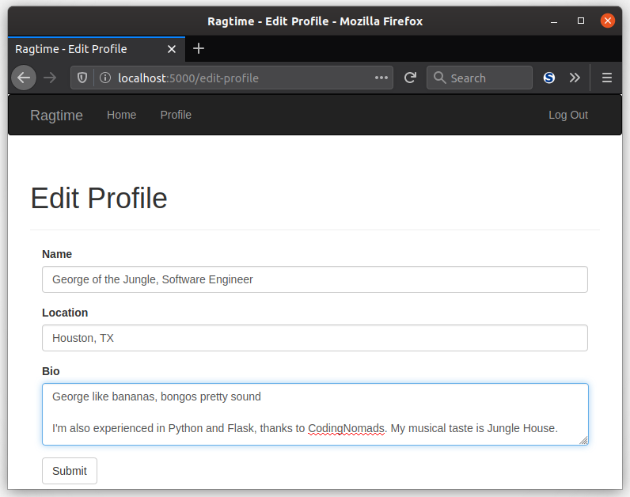
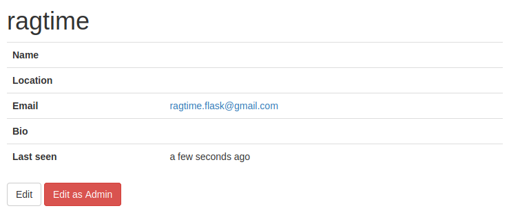
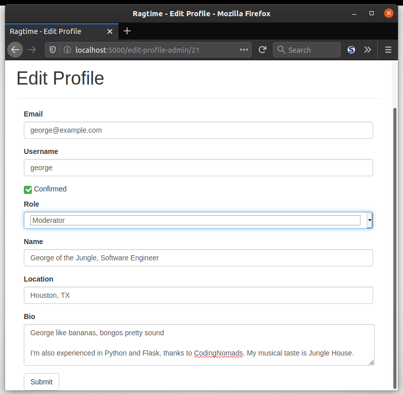

Now that you've got your user profile page up, you'll need to let your users edit their information. In this lesson, you'll learn just how to do that. Then, the next challenge you must face is to make a similar form for an administrator. Stay tuned!

### Edit Profile Form

#### The Form Itself

Your new `EditProfileForm` will be just a simple form for changing a users details, located in `main/forms.py`:

```python
class EditProfileForm(FlaskForm):
    name = StringField("Name", validators=[Length(0, 64)])
    location = StringField("Location", validators=[Length(0,64)])
    bio = TextAreaField("Bio")
    submit = SubmitField("Submit")
```

This has just a `TextAreaField` so that the user can <a href="https://idioms.thefreedictionary.com/go+to+town" target="_blank">go to town</a> on describing their own life, since it's more than just a simple text box. Or say nothing at all, since the `Length` validator isn't specified!

#### View Function

Then, the view function for the profile editor will go in `main/views.py`:

```python
@main.route('/edit-profile', methods=['GET', 'POST'])
@login_required
def edit_profile():
    form = EditProfileForm()
    if form.validate_on_submit():
        current_user.name = form.name.data
        current_user.location = form.location.data
        current_user.bio = form.bio.data
        db.session.add(current_user._get_current_object())
        db.session.commit()
        flash('You successfully updated your profile! Looks great.')
        return redirect(url_for('.user', username=current_user.username))
    form.name.data = current_user.name
    form.location.data = current_user.location
    form.bio.data = current_user.bio
    return render_template('edit_profile.html', form=form)
```

This is really nothing new for you, but one thing to note is that the form data is filled in with the existing information *before* the template is rendered. This of course happens because `form.validate_on_submit()` doesn't return true since it's not been submitted at the time the view function is first called.

#### Add A Button

Great, now that those are added, all that left is to give the user easy access to edit their profile *from* their profile. To add the button is simple, just open your `user.html` template:

```jinja2

<a class="btn btn-default" href="{{ url_for('.edit_profile') }}">
    Edit Profile
</a>

```

Of course, you wouldn't want another user to edit just anyone's profile, so a check is in place to make sure the currently signed is user is the same one as in the user page.

Your user editor, and new "Profile" navigation bar link, will look something like this:



### Make An Administrator-Level Profile Editor

Ready to challenge yourself to next level? Actually, an administrator is two levels above a user, so yeah, the next two levels. Admins can change any user's information, and that includes their username, confirmed status, and role, plus all the profile information. Great power requires great responsibility, so use wisely.

#### Fields

Your form will be called `AdminLevelEditProfileForm` in `main/forms.py`. You'll add these fields to it:

- `username` - This will be a `StringField` just like it is for the `RegistrationForm`, and also like it, you'll need to include a validator for the username
- `confirmed` - This is a `BooleanField`
- `role` - You'll make this a `SelectField`, which is another name for a dropdown menu (more below)
- `name` - This is a `StringField`
- `location` - This is a `StringField`
- `bio` - This is a `TextAreaField`

More information on the `SelectField` can be found <a href="https://wtforms.readthedocs.io/en/2.3.x/fields/#wtforms.fields.SelectField" target="_blank">here</a>. These fields must be initialized with a list of choices which you'll need to do in your new class's constructor. You'll also need the keyword argument `coerce=int` so that your field's values are integers, like roles in the database, instead of strings.

#### The User

Your form will also need to know which user it is comparing the input against. This is important for the username validator. For example, if the admin only needs to edit the user's role, then the username is still valid. But like with the `RegistrationForm`, if the username *does* change, it can't be the same as another user's username.

This should get you started with the form! Now onto the new view function.

#### View Function

Your view function will be called `admin_edit_profile` and will be a handler for the endpoint `'/editprofile/<int:id>'`. It will be located in `main/views.py`. You'll need to also require the user be authenticated and they will need to have admin rights. There are decorators for that. :)

Yes, this time you have a dynamic route, where the `id` is the user's identification that the admin can edit. The view function should be very similar to the `edit_profile()` view function you made before, except now you need to accommodate the new fields and query for the user that needs to be edited.

#### Add The Admin Edit Button

Lastly, you'll need to add another button to the `user.html` template so that the admin can edit a profile or user's information. You can use the `"btn btn-danger"` Bootstrap style for the `class` attribute of the `<a>` tag.

When all is said and written, your admin profile editor button and form should look like this:User editor and profile navigation bar





___

Hooray for being to add and edit profile information! In the next lesson, you'll give profiles a little more life with user avatars. You'll use a neat little web service for it.