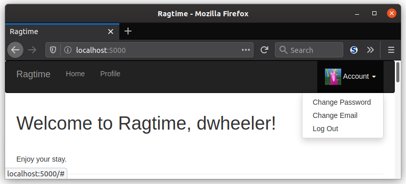

Don't you want your users to have avatars? And no, I don't mean airbenders or aliens, but...

Unicorns.


No, I'm not going crazy. Anyway, in this lesson, you'll learn about how you can give each user a unique avatar, or a profile pic they can use to represent themselves.

### Unicornify

A social media site can be improved with some pictures, especially for users. Because each user a is a unique snowflake. <a href="https://unicornify.pictures/" target="_blank">Unicornify</a> is a tiny service written by Benjamin Dumke-von der Ehe. Given an MD5 hash, the service will give you a unique image of a unicorn, like this one:


Unicornify is inspired by <a href="https://en.gravatar.com/" target="_blank">Gravatar</a>, which is the most popular avatar service. It associates each user's email with a unique avatar, and user's can change their avatar by making an account on the Gravatar website.

If you haven't visited the Unicornify website yet, it gives these instructions:

```
URL format: https://unicornify.pictures/avatar/$HASH?s=$SIZE

$HASH is any hexadecimal number, up to 64 digits.
$SIZE is the requested image size in pixels.
It should be a power of 2 between 32 and 128 (inclusive).
```

### hashlib

To make these MD5 hashes, we'll use each user's email as the input. Let's try an example email with the Python standard library `hashlib`:

```bash
(env) $ python
>>> import hashlib
>>> hashlib.md5('paul@example.com'.encode('utf-8')).hexdigest()
'a8780c6edeb8eda5678a38e94b8ecafe'
```

Then, if you plug that hash into Unicornify, the address `https://unicornify.pictures/avatar/a8780c6edeb8eda5678a38e94b8ecafe?s=128`, you get *this* unicorn:


She's beautiful.

### Unicornify User Method

To give the `User` model the ability to generate its own MD5 hash to create unicorns for each user, you can define the `unicornify` method:

```python
import hashlib

class User(UserMixin, db.Model):
    # ...
    def unicornify(self, size=128):
        url = 'https://unicornify.pictures/avatar'
        hash = hashlib.md5(self.email.lower().encode('utf-8')).hexdigest()
        return f'{url}/{hash}?s={size}'
```

The method ultimately returns a path directly to the image, where the image is defined by the base URL, the MD5 hash, then the size specified as a query string. Then as an example, let's try it out in a Flask shell session:

```bash
(env) $ flask shell
>>> User(email="paul@example.com")
>>> u.unicornify()
'https://unicornify.pictures/avatar/a8780c6edeb8eda5678a38e94b8ecafe?s=128'
>>> u.unicornify(size=32)
'https://unicornify.pictures/avatar/a8780c6edeb8eda5678a38e94b8ecafe?s=32'
```

### User Profile Images

To put your users' unicorns in their profiles, the first thing you can do to make your life a little easier is to define a custom CSS class. That way, you can reuse the profile picture in other places, conveniently. This is where the `app/static/` directory comes in. Similar to `app/templates/`, it is a directory that Flask looks for in order to find your custom styles and other assets.

Your custom CSS classes can go in `app/static/styles.css`. Then, you can define these two classes for your users' beautiful unicorns:

```css
.profile-thumbnail {
    position: absolute;
}
.profile-header {
    min-height: 260px;
    margin-left: 280px;
}
```

The first class is meant to be used as a class for your users' profile pics to help position the image. While you're at it, you can define a second class for all the other profile information to give it a little better positioning.

Now, all you need to do is apply those styles!:

```jinja2
{# user.html #}

<div class="profile-header">
    {# All the user profile info from before... #}
</div>
```

The `img-rounded` CSS class makes the image look a little more professional with rounded corners.

You still need to *link* your custom styles in order for them to be applied. And, to make your navigation bar a little fancier, you can add a dropdown and add a mini-thumbnail version of a user's unicorn. Both of these changes go in your `base.html` so that all your templates get your custom styles and the navigation bar addition:

```jinja2

{{ super() }}
<link rel="stylesheet" type="text/css" href="{{ url_for('static', filename='styles.css') }}">


{# ... #}

<li class="dropdown">
    <a href="#" class="dropdown-toggle" data-toggle="dropdown">
        
        Account <b class="caret"></b>
    </a>
    <ul class="dropdown-menu">
        <li><a href="{{ url_for('auth.change_password') }}">Change Password</a></li>
        <li><a href="{{ url_for('auth.change_email_request') }}">Change Email</a></li>
        <li><a href="{{ url_for('auth.logout') }}">Log Out</a></li>
    </ul>
</li>

<li><a href="{{ url_for('auth.login') }}">Log In</a></li>

```

Fancy, huh? The dropdown is possible thanks to Bootstrap's `dropdown-toggle` and `dropdown-menu` CSS classes.



<div class="alert alert-warning" role="alert"><strong>Note: </strong>While being able to change one's password or email is a nice feature, that'll be up to you to implement. Nothing personal, just that this course is more focused on building webapps with <i>Flask</i> and not full websites in general.</div>

### Generating Hashes Takes Work

What do all serious Bitcoin miner's have in common? Fans. Lots and lots of fans to cool the machines down.


Modern day miners

Even hashes for unicorns take computational work, and not something you want your server to do every time it needs to generate an image. Otherwise, this might happen:


To reduce the workload on your server, and because a user's email will be constant for the most part, it makes sense to **cache** the hash away so that it can be used to retrieve the unicorn more quickly:

```python
class User(UserMixin, db.Model):
    # ...
    avatar_hash = db.Column(db.String(32))
    def __init__(self, **kwargs):
        # ...
        if self.email is not None and self.avatar_hash is None:
            self.avatar_hash = self.email_hash()

    def email_hash(self):
        return hashlib.md5(self.email.lower().encode('utf-8')).hexdigest()

    def unicornify(self, size=128):
        url = 'https://unicornify.pictures/avatar'
        hash = self.avatar_hash or self.email_hash()
        return f'{url}/{hash}?s={size}'
```

By implementing this, you've in effect made a *hash cache*. Now impress your friends by saying that 50 times fast. The new method, `email_hash()`, is added to perform the grunt work of the hashing once `User` is first created. The new hash is stored in the `avatar_hash` column. The `unicornify()` method uses the stored cache if available or generates a new hash if there is none already.

___

You've just experienced a miracle. No, two miracles! The first is that you are done with the user profile section. The second is that you saw not one, but two unicorns! In the next section, you'll see even more unicorns as you build and generate the content of your webapp.