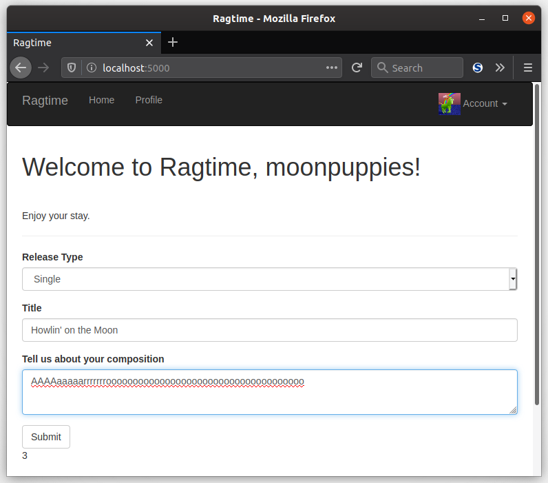

Many social media websites have a way to submit some form of content to the site. (The ones that don't must be a strange place.) The server of the website is responsible for sending responses all users who are allowed to see that content whenever they request it. In this section, you will implement the main feature of your app: to allow users to submit information about their musical creations. This lesson in particular will show you how your users can create content and how you can represent this content in the database.

### "Content" Can Mean A Lot Of Things


Yes, that is true. Often times in social media, the general word for a submittal of content is called a "post." You can make a *post* on your Facebook wall to share something with your audience. You can make a *post* on Reddit to complain about <a href="https://www.reddit.com/r/grilledcheese/comments/2or1p3/you_people_make_me_sick/" target="_blank">melts</a>. You can also *post* (the verb) your newest song on SoundCloud. For you and your app, it can be anything you want! But for the purposes of this course and making it more simple for you, a *post* will be called a **composition**.

That's because the "posts" in this case are users sharing their music with others, which can be <a href="https://thesyncopatedkeys.wordpress.com/2014/01/23/the-difference-between-a-single-ep-an-album-and-a-demo/" target="_blank">singles, EP's, or albums</a>. Each composition also has a title and a description, where users can describe their musical creation and post links to other places 1) where others can listen to it, and 2) to encourage others to support them by buying them. That's the idea anyway, feel free to get creative with it!

### The Composition Model

Now onto how to *program* this compositions thingy. Well, the first thing to do would be to represent them in the database, otherwise they might as well not exist at all. If you haven't noticed before, databases are often the first place to start adding new functionality, especially when it comes to storing data.

Ready to type some more code into `models.py`? Here's the new `Composition` database model, along with an addition to `User` to allow users to have their *own* compositions:

```python
class User(UserMixin, db.Model):
    # ...
    compositions = db.relationship('Composition',
        backref='artist', lazy='dynamic')


class ReleaseType:
    SINGLE = 1
    EXTENDED_PLAY = 2
    ALBUM = 3


class Composition(db.Model):
    __tablename__ = 'compositions'
    id = db.Column(db.Integer, primary_key=True)
    release_type = db.Column(db.Integer)
    title = db.Column(db.String(64))
    description = db.Column(db.Text)
    timestamp = db.Column(db.DateTime,
        index=True, default=datetime.utcnow)
    artist_id = db.Column(db.Integer, db.ForeignKey('users.id'))
```

As was mentioned before, each composition has a *release type* (single, EP, or album), a title, and a description. The `release_type` is represented as an integer, very similarly to how you set permissions in the User Roles section. In fact, just like `Permissions`, you can define a `ReleaseType` class that defines constants for each type. The `title` is a simple `db.String` type column, and `description` is a `db.Text` column just like the `bio` for the `User` model.

A couple more things: a `timestamp` column captures the time at which the composition was created, and an `artist_id` column contains the ID of the user who submitted the composition. Last but not least, a one-to-many `relationship` is formed between the `User` model and the `Composition` model. The `backref` is called `artist` so that the any `Composition` instance can grab the exact "maker" of that compositions.

### Composition Form

The next step? The form to make compositions of course. Here it is in its natural habitat in `app/main/forms.py`:

```python
class CompositionForm(FlaskForm):
    release_type = SelectField("Release Type", coerce=int, default=ReleaseType.SINGLE, validators=[DataRequired()])
    title = StringField("Title", validators=[DataRequired()])
    description = TextAreaField("Tell us about your composition")
    submit = SubmitField("Submit")

    def __init__(self, *args, **kwargs):
        super().__init__(*args, **kwargs)
        self.release_type.choices = [
            (ReleaseType.SINGLE, 'Single'),
            (ReleaseType.EXTENDED_PLAY, 'EP'),
            (ReleaseType.ALBUM, 'Album')]
```

The `CompositionForm` isn't much different from other forms you've seen. An important thing to note, which you should also be familiar with, is that the `release_type` `SelectField` must have `coerce=int` in order to play nice with the database. Your `ReleaseType`s are integers after all. The other half of making them play nice is to initialize the `SelectField` in the constructor. Lastly, both the release type and title are required in order to submit the form.

### Change The Index Page

Instead of burying the `CompositionForm` somewhere in the user interface, it'd be more useful to display it in the main page. As such, you can replace the currently used `NameForm` (if it's still there in your `index()` view function) with the `CompositionForm`. So, in `app/main/views.py`, put in the new form:

```python
@main.route('/', methods=['GET', 'POST'])
def index():
    form = CompositionForm()
    if current_user.can(Permission.PUBLISH)
            and form.validate_on_submit():
        composition = Composition(
            release_type=form.release_type.data,
            title=form.title.data,
            description=form.description.data,
            artist=current_user._get_current_object())
        db.session.add(composition)
        db.session.commit()
        return redirect(url_for('.index'))
    compositions = Composition.query.order_by(
        Composition.timestamp.desc()).all()
    return render_template(
        'index.html',
        form=form,
        compositions=compositions
    )
```

What's going on here? Hmm, well, it's the usual form handling stuff in a view function, but wait a sec... It's that `_get_current_object()` method showing its face again?! Remember this in `send_email()`? It was for the Flask `app` object because you were trying to speed up the email sending capabilities of your app. This time, you'll need it for the `current_user`.

You see, `current_user` is just like `current_app` in that it's a *proxy* for the current user, and not the actual `User` object that represents the user. By calling `_get_current_object()` on `current_user`, you are effectively taking a guilt-free shortcut. One, you don't have to get the `current_user`'s ID, then query the database for the actual `User`, then give that `User` to the new `Composition`. Two, `current_user` already knows what `User` object you want because its big secret is that it thinly wraps the actual `User` object. You don't want to use `_get_current_object()` all the time as it isn't necessary, but in this case it works great.

"Cool, thanks for that explanation. Now what's going on with passing all compositions to the `index.html` template?" Ah, well just like Facebook or Reddit or SoundCloud, all these platforms show you content on their homepage. It's the same sort of thing, but the content you show users are the compositions. The compositions are ordered by timestamp, so the newer ones show up first. The reason it is commented out will be clear in a minute...

### Make Sure It Works

Before you go about accommodating any compositions in your `index.html` template, you can first make sure your compositions can be created from your form. Without needing to render the compositions yet, you can test that a `Composition` can be created from your form by putting something like this somewhere in your template:

```jinja2
{{ compositions|length }}
```

This will show you how many compositions are currently in the database. It's only temporary for ensuring everything thus far works. It should all look something like this:



___

Once you've successfully proven to yourself that you can create compositions, you're ready to keep that momentum going. In the next lesson, you'll get your hands dirty with cleaning up your index template, including the display of your new content!
