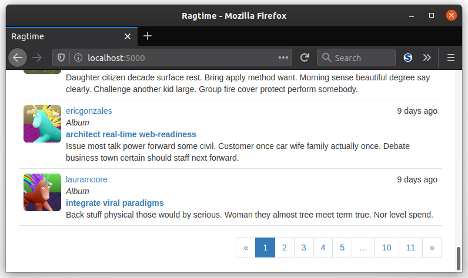

Paginating? What in Flask's sake is that? Because you don't live under a rock, you've seen this feature all the time on other websites. Few professional websites will force you to scroll through miles of content in a giant page. To make the user experience better, they will render any content into more digestible chunks and give the user the ability to see more chunks. Just like real pages in a book where all you need to do to read more is flip a page, **pagination** in web apps is the same thing but digital. In this lesson, you'll finally generate your fake data, then display it with a pagination widget.

### Flask-SQLAlchemy and Pagination

To quickly clamp down on the number of compositions you can see in your index page, you can take advantage of Flask-SQLAlchemy's `paginate()` method to replace the `all()` method. Bring your `index()` view function back up and let's get to it:

```python
@main.route('/', methods=['GET', 'POST'])
def index():
    # ...
    page = request.args.get('page', 1, type=int)
    pagination = \
        Composition.query.order_by(Composition.timestamp.desc()).paginate(
            page,
            per_page=current_app.config['RAGTIME_COMPS_PER_PAGE'],
            error_out=False)
    compositions = pagination.items
    return render_template(
        'index.html',
        form=form,
        compositions=compositions,
        pagination=pagination
    )
```

The first line shown is the page of content to render, and it is determined from the request's query string. If there is no page given in the query string, the default page shown is page 1. The `type=int` means that the "page" argument expects an integer, and if not the page is again set to 1. To display page 2 of content, the URL would look something like this:

```none
http://localhost:5000/?page=2
```

The `all()` in the `Composition` database query is replaced with `paginate()`, which takes the desired page number, the number of results to display at a time, and whether or not to issue a 404 error if the desired page is outside the range. The only required argument to `pagination()` is `page`, and the `per_page` argument (defaulted to 20) affects how many pages are needed to contain all of the content. Here, a configuration variable called `RAGTIME_COMPS_PER_PAGE` determines the number of results per page, and you can set your own value in `config.py`. For example, if there are 21 compositions and 20 results to display per page, the number of pages needed is 2. With `error_out` set to False, any invalid page number specified will result in an empty list of `Composition`s being returned.

Finally, the `compositions` variable is set to the `items` attribute of the `pagination` variable, which is an object of the `Pagination` class defined by SQLAlchemy. These `items` are the results in the particular page. The `pagination` variable is then passed to the template.

You're itching to see your fake content already, aren't you? With your basic pagination all ready to go, give your fake content creation a whirl in a Flask shell session:

```python
(env) $ flask shell
>>> from app import fake
>>> fake.users(20)
>>> fake.compositions(100)
```

Then, summon your webapp! Your index page will have a subset of all the compositions created. Be amazed by the complete gibberish that is displayed:


### Pagination Widget

This is a widget you can make once, then you won't have to keep fidgeting just to navigate to a new page.

#### Pagination Attributes and Methods

So why did you need to add a `pagination` object to the `index.html` template? Because it has a bunch of useful properties and methods! They are especially for controlling and displaying the page numbers from the user's perspective via a **pagination widget**. You probably noticed that there was no way to change the page unless you manually typed in the "page" argument in the query string. Here's some quick info on the attributes and methods of the `pagination` object:

| Attribute | Description                                                     |
| :-------- | :-------------------------------------------------------------- |
| has_next  | `True` if there is a next page relative to the current page     |
| has_prev  | `True` if there is a previous page relative to the current page |
| items     | The records in the current page                                 |
| next_num  | The page number after the current page                          |
| page      | The current page number                                         |
| pages     | The total number of pages                                       |
| per_page  | The number of items per page                                    |
| prev_num  | The page number before the current page                         |
| query     | The source query that was paginated                             |
| total     | The total number of items across all pages                      |

| Method       | Description                                                                        |
| :----------- | :--------------------------------------------------------------------------------- |
| iter_pages() | Iterator that returns a sequence of page numbers to display in a pagination widget |
| next()       | A pagination object for the next page.                                             |
| prev()       | A pagination object for the previous page.                                         |

The `iter_pages()` method is especially interesting. The method actually takes up to 4 arguments: `left_edge`, `left_current`, `right_current`, and `right_edge`, which are all integers.

- The `left_edge` argument is the number of pages to display starting from 1
- The 'left_current` argument is the number of pages to display before the current page
- The 'right_current` argument is the number of pages to display after the current page
- The `right_edge` argument is the number of pages to display ending from the last page

With default values of 2, 2, 5, and 2, respectively, that means calling the `iter_pages()` method while on page 10 out of 20 would iterate these pages, in order: 1, 2, `None`, 8, 9, 10, 11, 12, 13, 14, 15, `None`, 19, 20. `None`?! How can you be on page `None`? A `None` value actually indicates a gap in the sequence of pages. So you might see "..." to indicate some page numbers aren't displayed. If this all doesn't quite make sense, it will once you give a shot at making a pagination widget yourself.

#### Pagination Macro

Remember way back in the templates section where you were introduced to the `macro` control structure? It is used to make a "function" for your templates that can be called with arguments to generate even more Jinja goodness. Now is the perfect time to use this control structure, along with Bootstrap's pagination CSS classes, to create the pagination widget. The beauty of using a macro is that the pagination widget can be used again and again in different parts of your app. Let's give it a shot. Put this in a new file called `app/templates/_macros.html`:

```jinja2

<ul class="pagination">
    {# previous page link #}
    <li class="disabled">
        <a href="{{ url_for(endpoint,
            page = 1, **kwargs) }}#">
            &laquo;
        </a>
    </li>
    {# link to all shown pages #}
    
        
            <li class="active">
                <a href="{{ url_for(endpoint, page=p, **kwargs) }}">{{ p }}</a>
            </li>
        
        <li class="disabled"><a href="#">&hellip;</a></li>
        
    
    {# next page link #}
    <li class="disabled">
        <a href="{{ url_for(endpoint,
            page = pagination.pages, **kwargs) }}#">
            &raquo;
        </a>
    </li>
</ul>

```

The `pagination_widget` macro takes as arguments the pagination object and the endpoint where the pages are displayed in. To show the pagination of the compositions in the index page, you'd pass the `pagination` object originally passed in through the index view function, and the `endpoint` would be `'.index'`. The macro creates a Bootstrap pagination element, which is a styled unordered list.

Inside the Bootstrap pagination element is the, you guessed it, list of pages. You can apply links to all these displayed pages. The above macro defines the links in this way:

- First up is a "first page" link, represented by two double left angle brackets. If there is no previous page, then the `"disabled"` CSS class gets applied to it.
- The links for all the pages returned by the `iter_pages()` iterator. The link for each links to the the specific page number given as the argument to `url_for()`. A special `"active"` CSS class is given to the current page to make it pop out in the list of pages, and gaps are represented with ellipses.
- Finally, and like the "first page" link, a "last page" link is the final link in the Bootstrap pagination element. It gets disabled if there is no next page.

One more thing is that Jinja macros always pass in any keyword arguments without you needing to specify `**kwargs` in the macro signature. In the macro above, the `**kwargs` are passed into the `url_for()` function call which generates the pagination links. You can also use this same passing-keyword-arguments-into-`url_for()` for dynamic routes.

With your macro all done, you can use now use it in your `index.html` template! You'll all you'll need to do is `import` your `macros.html` file and call your macro:

```jinja2



{# ... #}
{# your code to render the compositions #}
{# ... #}

<div class="pagination">
    {{ macros.pagination_widget(pagination, '.home') }}
</div>

```

Here's what your pagination widget should look like:



Page numbers may vary. :)

___

You. Have. Gotten. *PAGES AND PAGES OF UNICORNS.* Er, I mean, pages of compositions that you and your users can now *navigate* through. And you made a fancy macro to enable that navigation that you can reuse elsewhere, wherever pages are needed. In the next lesson, you'll see about making another improvement to your composition rendering, and also give your users *just enough* control of their content.