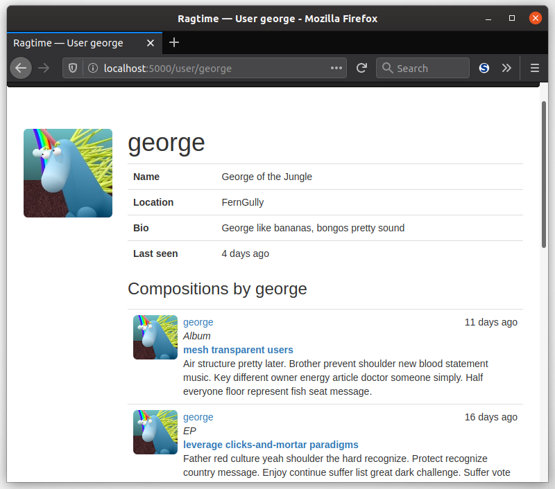
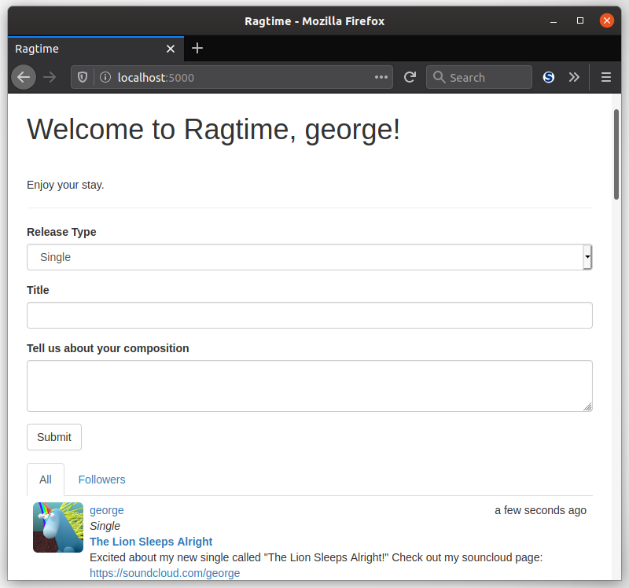

Did you know that, like counter tops, handles, and doorknobs, HTML can be sanitized, too? Well, not by the same means, but it prevents nasty attacks just the same. The difference being, it's not from tiny micro-organisms but from dubious hackers. Sanitizing HTML means you can strip any otherwise potentially harmful bits of HTML code, submitted by users, away from your website. In this lesson, you'll learn how to do that.

### Reusing Code, The *include* Way

You spent the last few lessons creating, "faking," and displaying compositions. Thinking back to the displaying, or rendering of the compositions, you used a `<ul>` to list all of them and you even paginated them in your index page. But what if you want to display compositions made by a certain user? You could certainly reuse that bit of HTML, couldn't you? That's exactly what the `` Jinja control structure was made for! By specifying another template to *include* in one template, you can easily "copy and paste" HTML around and make life less complicated.

#### What To Do

While you've been getting your hands dirty with *full* templates, you can actually keep around *partial* templates that aren't full pages in themselves, but that can help you make those full pages. In other words, you'd probably never name a partial template in a `render_template()` call, but you *could* use them in multiple "full" templates. You can denote these partial templates with an underscore at the beginning of their name, as the convention goes.

So, to make your composition rendering reusable, you can create a new template called `app/templates/_compositions.html` that contains the code starting at the `<ul>` element. Here's a reminder of what rendering your compositions would look like:

```jinja2
<ul class="compositions"> {# All compositions #}
    <li class="composition"> {# Single composition #}
        <div class="composition-thumbnail"> {# Avatar #} </div>
        <div class="composition-content"> {# Composition content #}
            <div class="composition-date">{# date #}</div>
            <div class="composition-artist">{# title #}</div>
            {# ... #}
        </div>
    </li>
</ul>
```

All of that can be placed in your new `_compositions.html`. Then, to plop that exact code into another template, all you need to do is use `` somewhere in your template.

<div class="alert alert-info" role="alert"><b>Task: </b>Make a new <code>_compositions.html</code> that can display a list of compositions.</div>

Thinking back to putting a user's compositions in their own page, let's try it in `user.html`, toward the bottom of the template:

```jinja2
{# ... #}
<h3>Compositions by {{ user.username }}</h3>
{% include '_compositions.html' %
{# ... #}
```

#### Don't Forget The Placeholders

Great! Now when you render a user page, their own compositions can show up. However, you'll still need to pass their `compositions` to the `render_template()` function. Any placeholders you have in your partial templates will need to be filled in by the "host" template, so those variables must be passed in though `render_template()`. Go ahead and also replace your list of compositions in the index page with a well-placed ``.

And because an individual user might have a good many compositions, it'd be good to paginate those.

<div class="alert alert-info" role="alert"><b>Task: </b>Just like you did in your `index()` view function, paginate the compositions of the specific user in the `user()` view function.</div>

Overall, you should only need to add a handful of lines in `user.html` to display the user's compositions (not including what is copied over from the ``). Here's what your user page will look like one you get that done:



### Handling HTML On The Server (Or Not)

If you were curious and tried HTML in the composition description, you'd have been disappointed to see that your HTML didn't go through and that your special formatting didn't work at all. That's because only the raw text is sent in the POST request as that would be a security risk otherwise. If HTML were allowed through the POST request, bad hackers could easily make harmful HTML sequences and submit them. Even if you do handle the HTML that gets submitted, you'll have to be careful about which HTML are allowed and which aren't. You'll get into that in a bit, but first, you'll allow formatting to show up.

To make it really easy for users to format their text with italics and bold and such in HTML, you could allow <a href="https://www.howtogeek.com/448323/what-is-markdown-and-how-do-you-use-it/" target="_blank">Markdown</a>, but this is an optional exercise for the reader. :) Instead what you'll do is allow HTML in the body of the composition form. You could do the conversion to HTML with your template, but that would require the template to convert the HTML *each and every time* the page renders. That can make things a bit less than ideal for the user.

The most important thing that music artists need in a music sharing domain? The ability to link to their other pages! Which can be done without Markdown thanks to a library called <a href="https://github.com/mozilla/bleach" target="_blank">Bleach</a> made by your friends at Mozilla. Go ahead and install it with pip, and optionally, you can install the Markdown package.

```bash
(env) $ pip install bleach markdown
```

#### Caching The HTML

Converting from text that *looks* like HTML to actual HTML can be done only once by keeping a copy of it in the database. You can add a new field in your `Composition` model to do just that. Here's what you can do:

[//]: # (TODO: May expand this to include Markdown)

```python
import bleach

class Composition(db.Model):
    # ...
    description_html = db.Column(db.Text)
    # ...
    @staticmethod
    def on_changed_description(target, value, oldvalue, initiator):
        allowed_tags = ['a']
        html = bleach.linkify(bleach.clean(value,
                                           tags=allowed_tags,
                                           strip=True))
        target.description_html = html


db.event.listen(Composition.description,
                'set',
                Composition.on_changed_description)
```

With this, you can register the `on_changed_body()` function as a "listener" of SQLAlchemy's "set" event for `description`. The important bits here are just the first two arguments. That means the function will be called automatically whenever the value of `description` changes to a new value. This new handler function is a copy of the `description` field, but it will keep around the HTML version of the composition descriptions so that you can render them in all their glory on your website.

The first thing that happens here is a call to Bleach's `clean()` function, which takes a list of allowed tags and makes sure any other tags are stripped from the HTML text. While for this app we'll only allow users to make links (which means using the `<a>` tag in HTML), there's all sorts of tags you *could* use if you wanted to. Think of `allowed_tags` as a whitelist. The `strip` keyword argument, if `True`, will remove any extraneous characters from the ends of the submitted text.

Finally, the text is passed to Bleach's `linkify()` function, which as you can probably guess, will make hyperlinks out of any URLs that are written in plain-text in the description. It will create the `<a>` tags automatically.

#### Putting The HTML In The Template

Once you have the automatic caching of the HTML version of the description put into place, the next step is to show it! A simple check for the `description_html` attribute will ensure that your template won't cause a 404 if it doesn't exist, like for your previously created compositions:

```jinja2
{# _compositions.html #}
{# ... #}
<div class="composition-description">
    
    {{ composition.description_html | safe }}
    
    {{ composition.description }}
    
</div>
{# ... #}
```

The `safe` filter is important here because otherwise Jinja will take your hard work and chuck it out of the template! It tells Jinja not to automatically escape the HTML elements, which it would normally do as a security measure. The key takeaway here is that you *know* it's safe because *you* generated the HTML on the server.



___

At this point, you can rest assured that any rogue HTML will be sanitized by your Flask server, and no spray bottle or disinfectant was needed. The next step in your content creation crusade? Permanent links. Go forth to the next lesson.
