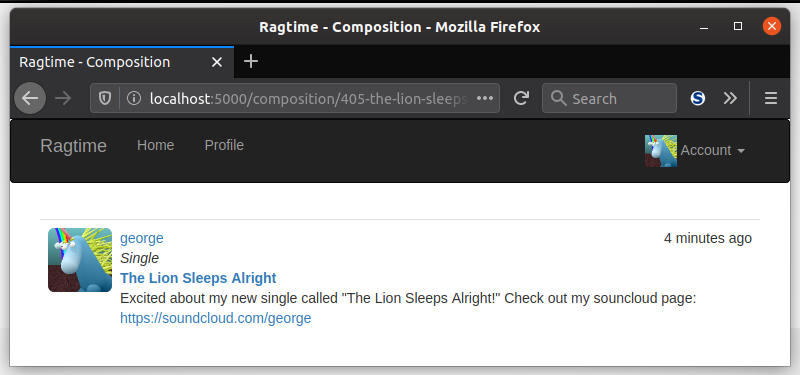

You've been on websites, and you've looked at content on those websites. Say you find a really cool thing, like an article on a technological innovation that allows ice cream to never melt called a "freezer" and you want to read more about it later. There's all kinds of content on this website, but how do you back to that *specific* article? Luckily, humans invented permanent links. These are unique URLs that reference specific content on a website. For your app, you'll be able to give permanent links to user-generated content like compositions so they can bookmark those pages to access them again. And send them to grandma.

### How Permanent Links Are Born

Some websites generate permanent links for content with a unique numeric ID that matches the ID of that particular data in their database. Your `Composition`s are a great example. Each one has a unique ID in the database which you can use to link directly to a specific composition. The first composition created in the database might have a permanent link that looks like this:

```http://localhost:5000/composition/1```

That works just fine! But what if you want to make permanent links that better represent what's contained at the link? Something that's more readable, like `.../composition/44315-the-shimmer-of-idols-album`. These are called **slugs** and that's exactly what you'll do for your permanent links to compositions, and each one is a unique string based on what's on the "other side" of the link.


### Making Your Slug

To generate slugs for your users' compositions, you'll want to encapsulate this bit of functionality in your `Composition` model. Not only that, it'd be good to add a new field for your slug to the model so that you can stash it away and even update if the user decides they want to change the title of their creation.

```python
import re

class Composition(db.Model):
    # ...
    slug = db.Column(db.String(128), unique=True)
    # ...
    def generate_slug(self):
        self.slug = f"{self.id}-" + re.sub(r'[^\w]+', '-', self.title.lower())
        db.session.add(self)
        db.session.commit()
```

This new column will contain a string long enough to hold any kind of title. To make a more human-readable permanent link, you can employ the use of regular expressions. Spaces and other non-letter and non-number characters won't look pretty in your new permanent link, so it's best to remove those and replace them with hyphens. Then, all the letters can be lowercased to make for a pretty link. In order to ensure each link to a composition is truly unique, it's necessary to tack on the actual ID of the composition. Two users could have the same composition title, so this ensures that both can be accessed separately.

You'll want to include this new function in your `fake.py` as well as your in your `index()` view function:

```python
# fake.py
def compositions(count=200):
    # ...
    db.session.commit()
    for c in Composition.query.all():
        c.generate_slug()

# main/views.py
def index():
    # ...
    if current_user.can(Permission.PUBLISH)
            and form.validate_on_submit():
        # ...
        db.session.add(composition)
        db.session.commit()
        # must be generated after first commit
        composition.generate_slug()
        return redirect(url_for('.home'))
```

Both of these calls to `generate_slug()` must be done *after* the compositions are submitted to the database. This is because the function depends on the composition's `id`, which isn't created until after the composition is committed.

### Add The Permanent Links

Now that your permanent links, or slugs, can be made, it's time to make those links come to life! What you'll need to do is make a new view function for an individual composition. The dynamic part of the route will correspond to the slugs in the database.

```python
@main.route('/composition/<slug>', methods=['GET', 'POST'])
def composition(slug):
    composition = Composition.query.filter_by(slug=slug).first_or_404()
    return render_template('composition.html',
                           compositions=[composition],
                           form=form,
                           comments=comments,
                           pagination=pagination)
```

You'll notice that this bit of code passes the composition contained in a list and represented as `compositions` to the template. That's so that you can reuse your `_compositions.html` once again to prevent you from doing double or triple the work! So, now you'll have a template that can render a single composition.

Speaking of which, you'll need to add permanent links to all of those beloved compositions you'll have listed in the index page and beyond.

<div class="alert alert-info" role="alert"><b>Task: </b>Add a link to the respective composition in your <code>_compositions.html</code> file. You can put the link in the title.</div>

Then, you'll need to make the template `composition.html` that can render the single composition.

<div class="alert alert-info" role="alert"><b>Task: </b>Create your <code>composition.html</code>. Don't forget to include <code>_compositions.html</code>!</div>



___

Once you're all done with that, congratulations! You've gotten another step closer to completing your first Flask web app. Now it's time to let your users edit their compositions at will, in the next lesson.
