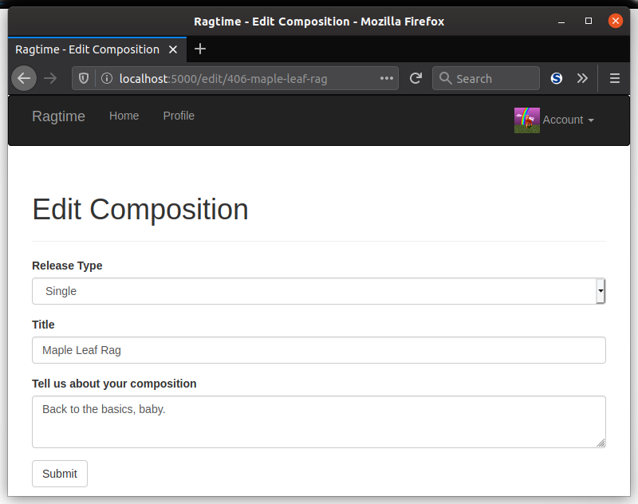

Just like you let users edit their profile, it's good to let them them have control of their compositions, too. Because you've done this before, it's time to let you take the reins and practice what you've learned thus far.

### Edit Composition Template

The first thing to do is to create a template which shows the form to edit one's composition. You can reuse `CompositionForm` to do just that. Call this template `edit_composition.html`.

### View Function

Then, of course, you'll need a view function that will render this template. Call your view function `edit_composition()`. Have it point to `edit/<slug>`, where the slug corresponds to the composition to edit. Make sure this is only accessible to the user who created the composition. It should also be accessible to any admins so that they can edit it, too. Anyone else who tries to edit a composition they didn't create should get a response with a 403 forbidden error.

One more thing: once the user submits their edits, you'll need to generate a new slug! The composition's ID won't change, but the title might, so you'll want to account for this in the slug.



### Edit Button

What's way easier than putting the URL of the "edit composition" page each time a user wants to edit their own composition? Make an edit button for them! In your `_compositions.html`, add some code so that an edit button will show up for each of the logged-in user's compositions, as well as an edit button for admins for all compositions.

You can make use of this style for positioning your buttons.

```css
div.composition-footer {
    text-align: right;
}
```


___

You've just completed the section on representing content in your webapp! All your users will be happy campers because they'll be able to post their own songs, albums, and EPs to their hearts' content. In the next section, you'll implement following and followers, so users can keep up with what each other is posting.
