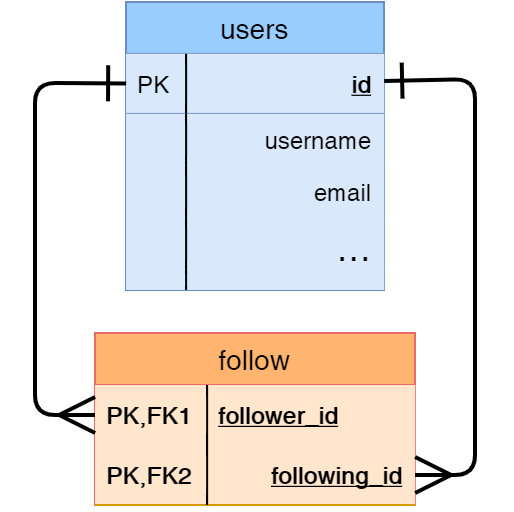

What do all social media apps have in common? The ability to follow, friend, buddy up, and/or subscribe to other users. That way, users can more easily keep up with what others are doing. In this section, you'll implement that capability into your app. This lesson in particular will introduce you to many-to-many relationships.

### A Refresher On Database Relationships

You've already learned that database relationships establish links between records. The most common type of relationship is the one-to-many relationship, where one record is linked with a bunch of other related records. Technically speaking, that means a foreign key is used on the "many" side to reference the primary key on the "one" side. You've already seen and implemented this kind of relationship as *one* role given to *many* users and *one* user having *many* compositions.

There are two more relationship types that can be seen as variants of the one-to-many relationship. These are the many-to-one relationship and the one-to-one relationship:

- The many-to-one relationship is simply the reverse of the one-to-many relationship type, or in other words, a one-to-many relationship from the perspective of the "many" side.
- A one-to-one relationship is just like a one-to-many relationship, except the "many" side can have only one element.

Things get murky when you start thinking about many-to-many relationships, because it's not as simple as those other three relationship types. A many-to-many relationship means there are *many* elements on one side linked to *many* elements on the other side.

#### Primer On Many-To-Many

One thing that one-to-many, many-to-one, and one-to-one relationships have in common is just that, that they all have at least *one* side with a single entity. So, to link a "many" to a "one", all you need is a foreign key to reference the "one" element on the "many" side. You might be thinking, "Okay, so I'd need a foreign key for one 'many' side, that just means I need to make another foreign key for another 'many' side, right?" Well, it's not quite that simple.

Let's think of an example. You're a student in a CodingNomads course, but there are more students than you taking the same course: that's one "many" side. The other "many" side is that one student can have access to *many* courses. How would you go about representing this in a database? Adding a foreign key to a course in the `student` table doesn't quite work, because one student could take many courses. Adding a foreign key to a student in the `courses` table doesn't work either because one course could be taken by multiple students!

#### Association Table

So what's the solution? Well, think of it this way. The `students` table needs a *list* of foreign keys to `courses`, and the `courses` table needs a *list* of foreign keys to the `students` table. Kind of sounds like two one-to-many relationships, doesn't it? The solution is to create a "middle man" of sorts, another table called an **association table**.

An association table "decomposes" so to speak the many-to-many relationships into two one-to-many relationships. It takes the on brunt of the work in *associating* one-of-the-many on one side (a student) to one-of-the-many on the other (a course). Call this table `registrations`, and it represents individual registrations of a student to a class. It has two foreign keys, for students and for courses.

To query this many-to-many relationship requires two steps. To get the list of courses taken by a student, the first step is to query the `registrations` table for rows that match the student's ID. That's the first one-to-many relationship. Then, the many-to-one relationship between `registrations` and `courses` is traversed to obtain all the list of courses. This works the other way, too, in that you can get the list of students who take a particular course.

### Implementing Followers In The Database

While all that's fine and dandy, the students and courses example relates two different kind of entities. You can find the courses a student takes and the students in a course, and there's an association table between the two. For your app, you're dealing entirely with users following other users. They are both `User`s! What is a student like you to do?

Fear not, for an association table can still be established between users and other users. It just means that both "one" sides of the two one-to-many relationships will point to the `users` table. This many-to-many relationship, decomposed to two one-to-many relationships, is *self-referential*.

___

With this new `follows` association table, you can can represent users following other users. You'll learn about that in the next lesson, if you keep *following* the trail...
