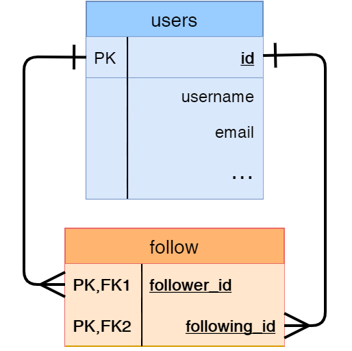

You learned about association tables in the last lesson, and how they can reconcile the more complex details of many-to-many relationships. You also learned about self-referential many-to-many relationships, which just means instead of linking two related but *different* entities, they link records in the *same* table to each other. In this lesson, you'll build one of these association tables called `follows` to help you create a self-referential relationship between users.

### Upgrade To The Association Table

[//]: # (TODO: terminology)

When dealing with many-to-many relationships between entities, association tables are a must. But technically, an association table consists only of the information needed to link the two together. That means just two foreign keys in the table, one for the first side of the many-to-many relationship, and another for the second side.

Sometimes, though, it's useful to keep track of information *about* that relationship. In the case of a user following some other user, it could be useful to know *when* that follow occurred. That way, you could show followers based on chronological order. The good news is: SQLAlchemy has the power to let you add this information! A super-association table of sorts.


#### Follow Model

Now that you're familiar with all the details of association tables, go ahead and start getting your hands dirty with some code. Type this out in `models.py`:

```python
class Follow(db.Model):
    __tablename__ = 'follows'
    follower_id = db.Column(db.Integer,
                            db.ForeignKey('users.id'),
                            primary_key=True)
    following_id = db.Column(db.Integer,
                             db.ForeignKey('users.id'),
                             primary_key=True)
    timestamp = db.Column(db.DateTime, default=datetime.utcnow)
```

Different versions of the word "follow" can get confusing, so to clarify: `follower_id` is the ID of the user who follows another, and `following_id` is the user who is followed. The *follower* user is *following* the second user.

Now that that's out of the way, the code shouldn't be too surprising, as you have already made models with certain columns being primary keys and others having foreign keys. What you probably *haven't* seen is both of them together. What gives, here? Of course, both foreign keys must be users, because thus far, users can't follow anyone else in your web app. (And if you did have something like that, you'd need another association table.) By setting `primary_key` to `True` for both columns, both foreign keys *together* form the primary key. That means the *pair* of IDs is the key.

Finally, the last column, `timestamp`, is simply the time the *follower* started *following* the other. Each row that is created in this table automatically sets `timestamp` to the time the row is inserted.

#### Associating The Association

Great, now you have your souped up association table. It's time to give it something to associate *with*, and that something is the `users` table.

Your `User` model will need to connect to the `Follow` model:

```python
class User(UserMixin, db.Model):
    # ...
    following = db.relationship('Follow',
                               foreign_keys=[Follow.follower_id],
                               backref=db.backref('follower', lazy='joined'),
                               lazy='dynamic',
                               cascade='all, delete-orphan')
    followers = db.relationship('Follow',
                                foreign_keys=[Follow.following_id],
                                backref=db.backref('following', lazy='joined'),
                                lazy='dynamic',
                                cascade='all, delete-orphan')
```

With this, you create the two one-to-many relationships.



**`foreign_keys`:** `foreign_keys` keyword argument must be specified since there are two foreign keys in the association table. Without it, SQLAlchemy wouldn't know which foreign key to use as it would be too ambiguous.

**`backref`:** Next is the `backref` argument which is a reference *back* to the `User` *from* the `Follow` model. If you remember the discussion about relationships back in the Database Management section, `backref` adds an attribute to the model given in the first argument of `db.relationship()`. So, from an instance of `Follow`, you can refer to `follower` as the `User` who follows the other. You can refer to `following` as the `User` being followed. So you can get the "one" sides, all because of the work done by `backref`. With `User` you just need to use `following` and `followers` to get you the list of other users that user follows or who follows them.

**`joined` lazy mode:** But what's with the `db.backref()` or the extra `lazy` argument? Well, the `db.backref()` is just a way to define extra arguments for the `backref` argument in `db.relationship()`. The `joined` lazy mode causes any related `Follow` objects to be loaded immediately from the *join* query. Say a user, George, has 10 followers. If you have George's `User` object as `george`, calling `george.followers.all()` gives a list of 10 `Follow` instances. Each of those instances has the `follower` and `following` back reference attributes set to the corresponding users. With `joined`, all this happens in a single database query. You can get all of the information you need loaded and ready to go just from the `george.followers.all()`. The default `select` lazy mode would instead require 11 total database queries! Ten of them would be needed to query the individual users in each `Follow` instance.

**`dynamic` lazy mode:** As for the second `lazy` argument on the `User` side, it is set to the `dynamic` lazy mode similar to the relationship between `Role` and `Users`. The relationship attributes in this case return a query object so that additional filters can be added, instead of just returning the items directly.

**`cascade`:** The `cascade` argument changes how actions are propagated from a parent to related objects. Usually the default cascade options are appropriate for most cases, but in this case, you'll want to change the default for the case when any `Users` are deleted from the database. By default, when a `User` gets deleted, any values in the `follows` table that match that User are set to a null value. Instead, the `delete-orphan` is added so that all entries that match the deleted user in the `follows` table are *also* deleted, destroying the link.

<div class="alert alert-info" role="alert"><b>Info: </b>The <code>cascade</code> argument takes a comma-separated list of options. The <code>all</code> option represents all cascade options except <code>delete-orphan</code>.</div>

### Operating With Followers

Phew, now that that's all done, you'll want to define helper methods. These will be defined in the `User` model so that you can more easily handle database operations with followers and those they follow:

```python
class User(UserMixin, db.Model):
    # ...
    def follow(self, user):
        if not self.is_following(user):
            f = Follow(follower=self, following=user)
            db.session.add(f)

    def unfollow(self, user):
        f = self.following.filter_by(following_id=user.id).first()
        if f:
            db.session.delete(f)

    def is_following(self, user):
        if user.id is None:
            return False
        return self.following.filter_by(
            following_id=user.id).first() is not None

    def is_a_follower(self, user):
        if user.id is None:
            return False
        return self.followers.filter_by(
            follower_id=user.id).first() is not None
```

The first method, `follow()`, performs the "follow" action accordingly in the database, in which a new row is inserted in the `follows` table linking a user to the passed-in `user`. The `unfollow()` method does the reverse: it will delete the row pertaining to the user that is to be unfollowed.

Two things to keep in mind here. First, the `follow()` method does not need to add `timestamp` when creating the new `Follow` instance. That's because it's already set to the current date and time by default. Second, neither the `follow()` and `unfollow()` methods have a `db.session.commit()` because there might be other operations that need to be done alongside a user following or unfollowing another.

Next is `is_following()`, and as you probably guessed, it determines if the user is following the specified user. And `is_a_follower` determines if another user is a follower. Both make sure the `user` has been assigned an `id` before querying for it in the database, as that would cause an exception.

___

You are well on your way to get followers following all sorts of followed users. In the next couple of lessons, you'll let users do just that from the webapp.


