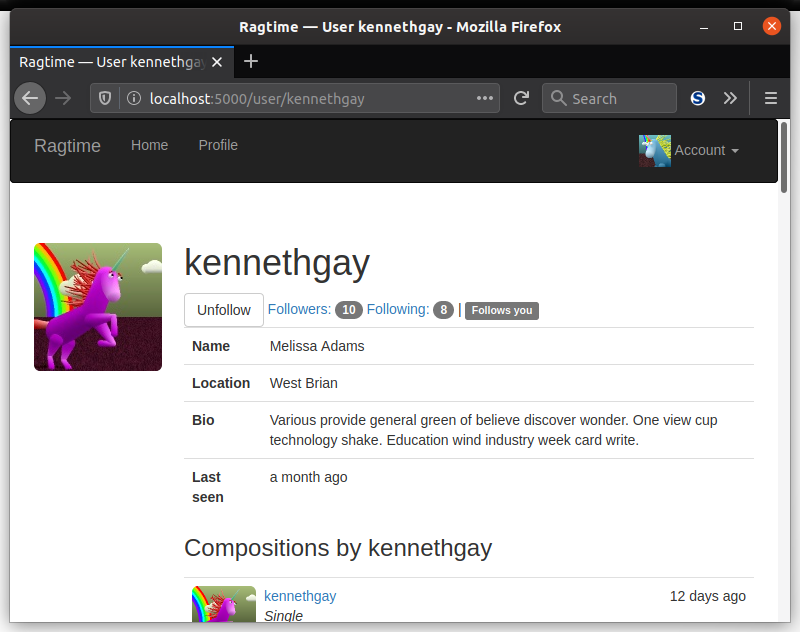
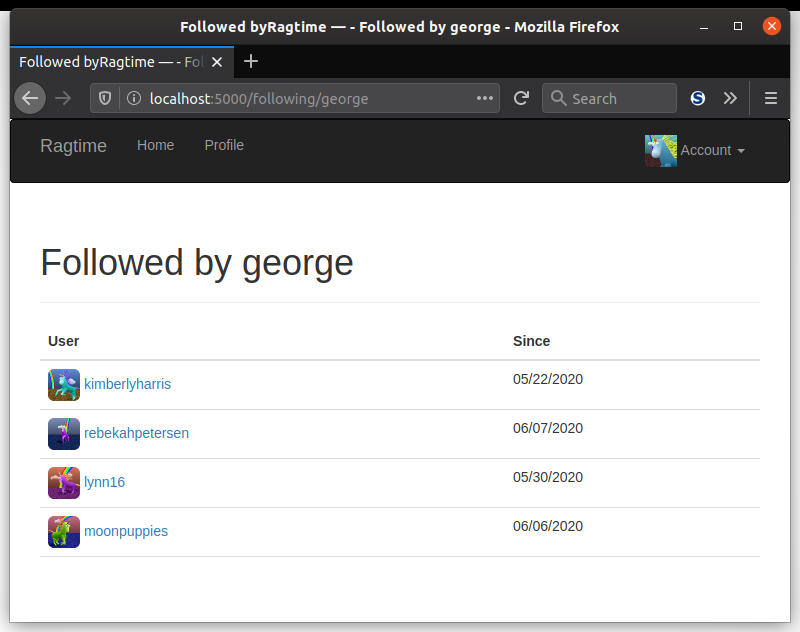

Of course, what comes with view functions are always templates, whether they are rendering the contents of a view function or providing links for another. This lesson tasks you with defining buttons for following and unfollowing, as well as links to see followers and those they are following.

### Add To User Template

You are tasked with adding to the user template the following:

- Follow button: This button will only show if the user has permission to follow others and if the user is not the current user. Have this link to your `follow()` view function. It should display "unfollow" if the current user already follows the user.
- Show how many followers the displayed user has. You can use the Bootstrap `badge` class on a `<span>` tag to show it prettily. This should also link to the `followers()` view function.
- Show how many users the displayed user is following. This should link to the `following()` view function.
- If the displayed user is not the current user, show "Follows you". You can use the Boostrap `label` class on a `<span>` tag to show it prettily.

Once you're done, it will look something like this:



### Showing Followers and Following

Once you get the follower information on the user page, the next thing to do is to show users that are followed by a user and that are following a user. This can all be done with the `followers.html` template. You referenced this template in your `followers()` and `following()` view functions.

- You can implement this as a two column table, with the first column showing the username of the user and their avatar. The second column will show the `timestamp`.
  - This table can use the Bootstrap `table`, `table-hover`, and custom `followers` class.
    ```css
    .table.followers tr {
        border-bottom: 1px solid #e0e0e0;
    }
    ```
- You'll need to show the pagination widget at the bottom of the page.

The page will look something like this:



(note: there's no widget shown because it's just one page)

___

Sweet, now to move on joins in the database.
