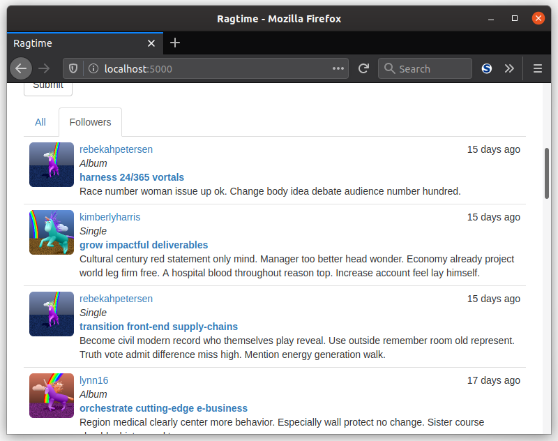
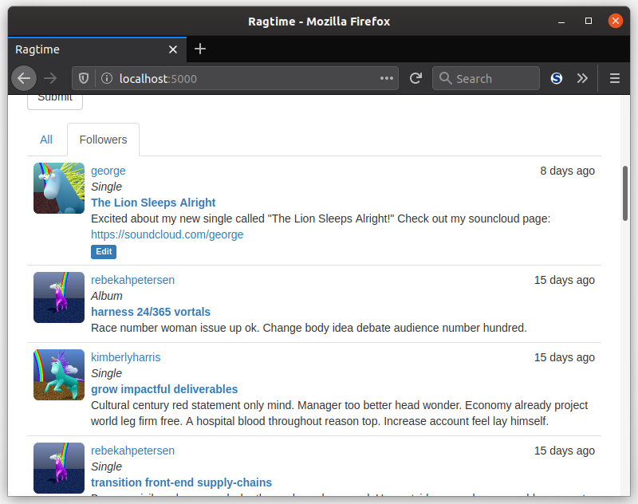

Yeehaw! You're almost all done with getting follower and following and follow-these-compositions-and-those-users working in your web app. The last step is to just show the followed compositions or all compositions in the home page of your app, which this lesson will guide you through.

### Viewing Choices

With a quick addition to the `index()` view function, you can allow users to view compositions posted by followed users or all compositions posted by all users. You might remember the discussion on cookies back in the sections on User Authentication and Sending Emails. Well, you can use your own stored cookies to allow the user to change what they see:

```python
@main.route('/', methods=['GET', 'POST'])
def index():
    # ...
    show_followed = False
    if current_user.is_authenticated:
        show_followed = bool(request.cookies.get('show_followed', ''))
    if show_followed:
        query = current_user.followed_compositions
    else:
        query = Composition.query
    pagination = query.order_by(Composition.timestamp.desc()).paginate(
        page,
        per_page=current_app.config['RAGTIME_COMPS_PER_PAGE'],
        error_out=False)
    compositions = pagination.items
    return render_template(
        'index.html',
        form=form,
        compositions=compositions,
        show_followed=show_followed,
        pagination=pagination
    )
```

The user's choice is stored in a cookie called `show_followed`. Whenever the user is logged in, the `show_followed` cookie is loaded. The string value of the cookie is converted to a boolean, and depending on it's value, the `query` variable is set to either followed or all compositions. All compositions are shown with the `Composition.query`, and only followed compositions are shown with your newly created property `User.followed_compositions`.

#### Setting Cookies

But how does this cookie get set? With more view functions of course! At least, that's an easy an effective way of doing it:

```python
@main.route('/all')
@login_required
def show_all():
    resp = make_response(redirect(url_for('.index')))
    resp.set_cookie('show_followed', '', max_age=30*24*60*60) # 30 days
    return resp


@main.route('/followed')
@login_required
def show_followed():
    resp = make_response(redirect(url_for('.index')))
    resp.set_cookie('show_followed', '1', max_age=30*24*60*60) # 30 days
    return resp
```

Now you can add these routes to your index page template. When either of these functions are invoked, the `show_followed` cookie gets set to the proper value. However, only response objects can set cookies. The good news is that these response objects can be created within your view functions with the `make_response()` function. Flask automatically makes response objects out of whatever you pass in the `return` statement, whether it be a string containing HTML or a `render_template()` function call. Or, they can be manually created in this case and passed directly.

The `make_response()` function takes the name of the cookie first, then the value it will take on. The `max_age` argument sets the number of seconds until the cookie expires, and without a value the cookie will be deleted on browser close. The maximum age of these cookies is set to 30 days, so if followed posts are chosen for the user to view, it will be remembered until 30 days have passed. It gets renewed if the user makes a different choice.

#### Add Tabs To Home Page

All that's needed for your index page template is some nice looking tabs. These can be added while making use of your `show_followed` cookie and new routes:

```jinja2
{# ... #}
<div class="composition-tabs">
    <ul class="nav nav-tabs">
        <li class="active">
            <a href="{{ url_for('.show_all') }}">All</a>
        </li>
        
        <li class="active">
            <a href="{{ url_for('.show_followed') }}">Followers</a>
        </li>
        
    </ul>
    
</div>
{# ... #}
```

If you haven't already, you can use this custom style for the tabs:

```css
div.composition-tabs {
    margin-top: 16px;
}
```



But what about the user's own compositions? Shouldn't those show up, too? You can address this easily by registering all users as their own followers, as they are created.

```python
class User(UserMixin, db.Model):
    # ...
    def __init__(self, **kwargs):
        # ...
        self.follow(self)
```

As you might imagine, the users in the database have already been created and so this won't work for those users. You could of course nuke the database and start over, but you don't have to. There's an easy solution, and that is to add a static method, just like for the `insert_roles()` function in the `Role` model. You can make an update function like so:

```python
class User(UserMixin, db.Model):
    # ...
    @staticmethod
    def add_self_follows():
        for user in User.query.all():
            if not user.is_following(user):
                user.follow(user)
                db.session.add(user)
                db.session.commit()
```

Then, you can run it straight from a Flask shell session:

```python
(env) $ flask shell
>>> User.add_self_follows()
```



The only problem now? The user count in the user pages doesn't reflect the true count. Sure, the user is following themselves, but that's not what the users would expect. You just made a bit of hack so that they could see their own posts. So, to fix that, make sure you change the follower and following count to be one less in the user page.

<div class="alert alert-info" role="alert"><b>Task: </b>In your <code>user.html</code> template, change follower and following count to be one less.</div>


[//]: # (TODO: Unit tests will have to be change as well.)

___

Awesome sauce! You're all done with adding following functionality to your webapp! The next section will introduce you to APIs and how to include one in your very own webapp.
